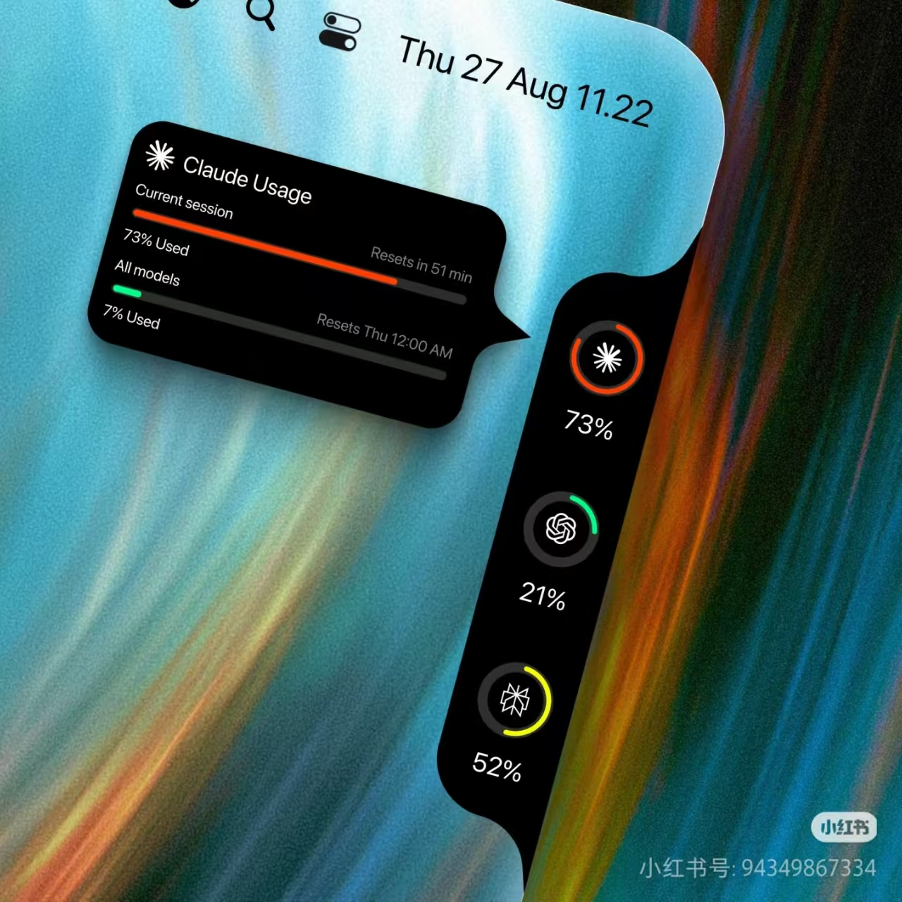
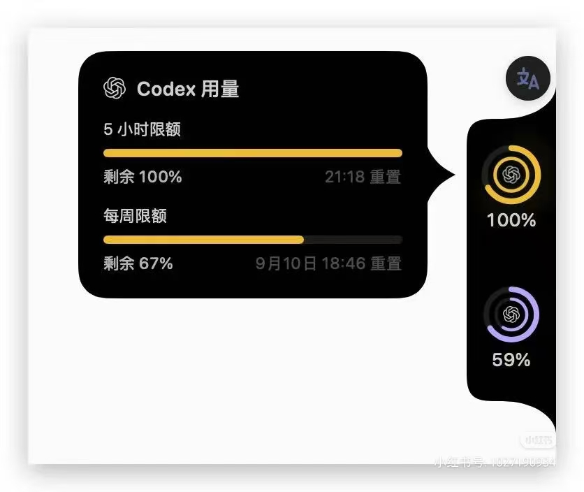
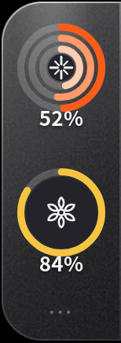
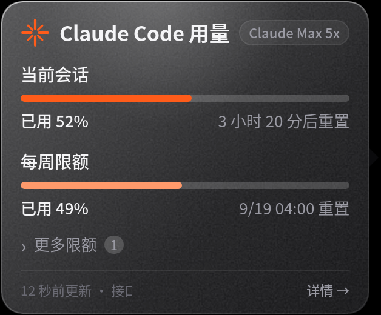
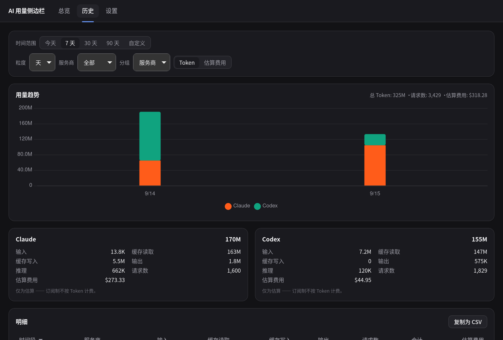
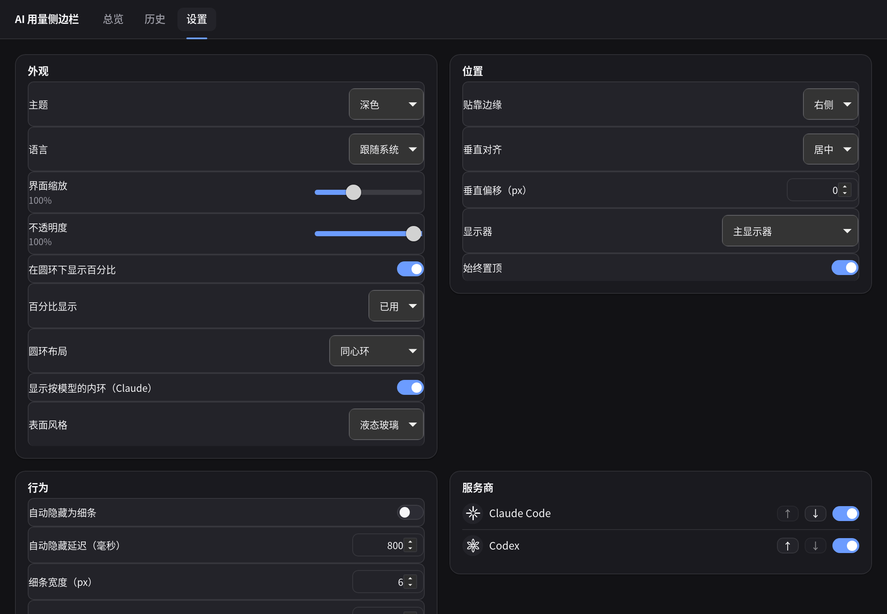

# AI Usage Sidebar

> An always-on-top edge sidebar that shows your **Claude Code** and **OpenAI Codex**
> rate-limit quotas at a glance — one ring per provider, a detail popover on hover,
> and a dashboard with your local token-usage history.

<p align="center">
  
  
</p>

<sub>The two images above are the design reference this project targets: a thin bar hugging
the screen edge, vertically centred, with the popover opening towards the middle of the
screen and its tail pointing back at the hovered ring.</sub>

[中文说明见下 ↓](#ai-使用量侧边栏)

---

## Screenshots

Real captures from CachyOS / GNOME (XWayland), dark theme, liquid-glass surface:

<p align="center">
  
  
</p>
<p align="center">
  
  
</p>

## What it is

`AI Usage Sidebar` is a small desktop widget built with **Tauri 2 (Rust)** and
**SvelteKit / Svelte 5**. It lives on the edge of your screen, above other windows,
and answers one question without interrupting you: *how much of my Claude / Codex
quota is left, and when does it reset?*

* One **progress ring per provider** (or one per window in `ringMode: "all"`).
* Hovering a ring opens a **popover** with every rate-limit window — 5-hour,
  weekly, per-model — plus its reset time. The popover never steals keyboard focus.
* A **dashboard** window holds settings and the **token-usage history** parsed from
  the providers' own local session logs, so you can compare plans and providers
  over time (with an *indicative* API-price estimate).
* A **tray icon** to show/hide the bar, toggle auto-hide, refresh, open the
  dashboard or quit.

## Features

| | |
|---|---|
| Edge docking | Left or right edge, top / centre / bottom, with a pixel offset, on any monitor |
| Auto-hide | The bar collapses to a thin handle when you move the pointer away and expands on hover |
| Pinning | Click a ring to pin the popover open while you read it |
| Always on top | Re-asserted after every map on X11, visible on all workspaces |
| Glass surface | `surfaceStyle: "glass"` uses a real blurred backdrop where the OS has one (macOS vibrancy, Windows acrylic); `"solid"` turns it off |
| Themes | Dark / light / follow the system |
| i18n | English and 简体中文 (tray menu included) |
| History | Incremental ingestion of session logs into SQLite; per-model, per-day/-week/-month totals |
| Cost estimate | Optional API-equivalent price estimate, clearly labelled as a comparison indicator |
| Autostart | Optional login item (`--hidden`) |
| Notifications | Optional warning when a window crosses your threshold |

## Providers

| Provider | Plan | Rate-limit windows shown |
|---|---|---|
| Claude Code (OAuth) | Pro | 5-hour session **+** weekly (all models) |
| Claude Code (OAuth) | Max 5× / Max 20× | 5-hour session **+** weekly, plus per-model weekly windows (e.g. Opus) when the API reports them |
| OpenAI Codex (ChatGPT login) | Plus | 5-hour **+** weekly |
| OpenAI Codex (ChatGPT login) | Pro / "prolite" | weekly only — these plans have no 5-hour window |
| OpenAI Codex | Team / Business / Enterprise / Edu | whatever the API reports, classified by window length |
| OpenAI Codex | API-key mode (`auth_mode: "apikey"`) | no quota windows exist; the ring shows "not signed in" |

Window kinds are **detected from the API**, never assumed: a window is classified
by its `limit_window_seconds` (≤ 6 h → 5-hour, ~7 d → weekly, anything else →
"other"), because on Codex Pro the *primary* window is the weekly one.

## How it reads your data

Everything happens on your machine. The app reads the credentials the official
CLIs already wrote, calls the same two endpoints the CLIs call, and parses the
session logs those CLIs leave on disk.

**Credentials**

| Provider | Location |
|---|---|
| Claude | `~/.claude/.credentials.json` (Linux, Windows) · macOS Keychain item `Claude Code-credentials` · override the directory with `CLAUDE_CONFIG_DIR` |
| Codex | `~/.codex/auth.json` · override the directory with `CODEX_HOME` |

**Endpoints**

| Provider | Request |
|---|---|
| Claude | `GET https://api.anthropic.com/api/oauth/usage` (and `/api/oauth/profile` for the plan label), `Authorization: Bearer …`, `anthropic-beta: oauth-2025-04-20` |
| Codex | `GET https://chatgpt.com/backend-api/wham/usage`, `Authorization: Bearer …`, `ChatGPT-Account-Id: …` |

**Local logs (token history, and a fallback when you are offline)**

| Provider | Location |
|---|---|
| Claude | `~/.claude/projects/**/*.jsonl` |
| Codex | `~/.codex/sessions/YYYY/MM/DD/rollout-*.jsonl`, `~/.codex/archived_sessions/**` |

> **Privacy.** Your tokens never leave your machine except in the request to
> Anthropic's and OpenAI's own endpoints — the same ones `claude` and `codex`
> already talk to. There is no telemetry, no analytics and no third-party
> service. Prompts and completions are never read; only the token *counters* and
> model names in the log files are.

## Install

### Releases

Grab the installer for your platform from the
[Releases page](https://github.com/harveyxiacn/AI-usage-monitor-sidebar/releases):
`.deb` / `.rpm` / `.AppImage` (Linux), `.dmg` (macOS), `.msi` / `.exe` (Windows).

### Build prerequisites

**CachyOS / Arch**

```sh
sudo pacman -S --needed webkit2gtk-4.1 libayatana-appindicator librsvg base-devel rustup nodejs pnpm
rustup default stable
```

**Debian / Ubuntu**

```sh
sudo apt update
sudo apt install -y libwebkit2gtk-4.1-dev libayatana-appindicator3-dev librsvg2-dev \
  patchelf libgtk-3-dev libsoup-3.0-dev libjavascriptcoregtk-4.1-dev \
  build-essential curl wget file libssl-dev
curl --proto '=https' --tlsv1.2 -sSf https://sh.rustup.rs | sh
corepack enable pnpm
```

**macOS** — Xcode command line tools (`xcode-select --install`), Rust
(`rustup`), Node 22+ and pnpm. macOS 11 or newer.

**Windows** — Visual Studio Build Tools (C++ desktop workload),
[WebView2 runtime](https://developer.microsoft.com/microsoft-edge/webview2/)
(pre-installed on Windows 11), Rust and Node 22+ / pnpm.

GNOME users on Linux also want the
[AppIndicator extension](https://extensions.gnome.org/extension/615/appindicator-support/)
for the tray icon.

## Build & run

```sh
pnpm install
pnpm tauri dev     # development, with hot reload
pnpm tauri build   # release bundles in src-tauri/target/release/bundle/
# Arch / CachyOS: linuxdeploy's strip step fails on current binutils, so build the
# AppImage with `NO_STRIP=true APPIMAGE_EXTRACT_AND_RUN=1 pnpm tauri build --bundles appimage`
```

Useful environment variables:

| Variable | Effect |
|---|---|
| `AI_USAGE_SIDEBAR_BACKEND=wayland` | Do **not** force XWayland (see below) |
| `AI_USAGE_SIDEBAR_LOG=debug` | Verbose logging, including every window placement |
| `AI_USAGE_SIDEBAR_DEVTOOLS=1` | Open the WebKit inspector in debug builds |
| `CLAUDE_CONFIG_DIR`, `CODEX_HOME` | Point the app at non-default CLI directories |

## Platform notes

* **Linux / GNOME Wayland (primary development target).** Wayland does not let a
  client position its own windows or keep them above others, so the app forces
  `GDK_BACKEND=x11` (XWayland) unless you set `AI_USAGE_SIDEBAR_BACKEND=wayland`.
  With the proprietary NVIDIA driver it also sets
  `WEBKIT_DISABLE_DMABUF_RENDERER=1`, without which WebKitGTK renders black.
* **KDE / wlroots (Hyprland, Sway).** Native Wayland support through the
  `wlr-layer-shell` protocol is planned; until then run it on XWayland too.
  Linux has no client-side blur on GNOME, so the glass surface is the webview's
  own translucent fill; KWin blur-behind is on the roadmap.
* **macOS.** Builds and runs (Intel + Apple Silicon); the overlay windows use
  `macOSPrivateApi` for transparency and a real `NSVisualEffectView` backdrop
  (HUD material) when `surfaceStyle` is `glass`. Not yet notarised — right-click
  → *Open* on first launch.
* **Windows.** Builds and runs, with the DWM acrylic backdrop for the glass
  surface; the tray icon takes the left-click to toggle the dashboard.
  Considered beta.

Details, including the geometry maths and the hover state machine, are in
[`docs/PLATFORM.md`](docs/PLATFORM.md). The module and command contracts are in
[`docs/ARCHITECTURE.md`](docs/ARCHITECTURE.md).

## Where your configuration lives

| | Linux | macOS | Windows |
|---|---|---|---|
| Settings | `~/.config/io.github.harveyxiacn.ai-usage-sidebar/settings.json` | `~/Library/Application Support/io.github.harveyxiacn.ai-usage-sidebar/settings.json` | `%APPDATA%\io.github.harveyxiacn.ai-usage-sidebar\settings.json` |
| Database & cache | `~/.local/share/io.github.harveyxiacn.ai-usage-sidebar/usage.db` | `~/Library/Application Support/io.github.harveyxiacn.ai-usage-sidebar/usage.db` | `%APPDATA%\io.github.harveyxiacn.ai-usage-sidebar\usage.db` |
| Logs | `~/.local/share/io.github.harveyxiacn.ai-usage-sidebar/logs/` | `~/Library/Logs/io.github.harveyxiacn.ai-usage-sidebar/` | `%APPDATA%\io.github.harveyxiacn.ai-usage-sidebar\logs\` |

Deleting `settings.json` resets the app to its defaults (right edge, vertically
centred, always visible, dark theme).

## Roadmap

- [ ] `wlr-layer-shell` support for KDE / Hyprland / Sway (true native Wayland)
- [ ] Blur behind the bar on KWin (`_KDE_NET_WM_BLUR_BEHIND_REGION`)
- [ ] More providers (Gemini CLI, GitHub Copilot, Cursor)
- [ ] Menu-bar mode on macOS
- [ ] Per-project token breakdown and CSV export
- [ ] Notarised macOS builds and a signed Windows installer
- [ ] Optional burn-rate forecast ("at this rate your weekly window runs out on …")

## Contributing

Issues and pull requests are welcome. Please read `docs/ARCHITECTURE.md` first —
it is the contract for module boundaries, shared types, commands and events.
Before opening a PR:

```sh
pnpm check
cd src-tauri && cargo fmt --all -- --check && cargo clippy -- -D warnings && cargo test
```

Never paste real tokens into an issue; redact `accessToken` / `refresh_token`
from any log you attach.

## License

MIT © Harvey Xia. See [LICENSE](LICENSE).

---

# AI 使用量侧边栏

> 一个常驻屏幕边缘、置顶显示的小挂件，一眼看清 **Claude Code** 与 **OpenAI Codex**
> 的额度用量：每个服务一个进度环，悬停弹出详情，仪表盘里还有本地 token 使用历史。

<p align="center">
  
  
</p>

<sub>上面两张图就是本项目的设计参考：细窄的竖条紧贴屏幕边缘、垂直居中，详情弹层朝屏幕中心方向展开，尖角指回被悬停的那个环。</sub>

## 截图

在 CachyOS / GNOME（XWayland）上的真实截图，深色主题、液态玻璃表面：

<p align="center">
  
  
</p>
<p align="center">
  
  
</p>

## 这是什么

`AI Usage Sidebar` 用 **Tauri 2（Rust）** + **SvelteKit / Svelte 5** 编写，
常驻屏幕边缘、置顶于其他窗口之上，只回答一个问题：*我的 Claude / Codex 额度
还剩多少、什么时候重置？*

* 每个服务一个**进度环**（`ringMode: "all"` 时每个限额窗口一个环）。
* 悬停某个环会弹出**详情层**，列出全部限额窗口——5 小时、每周、按模型——以及各自的重置时间。弹层**不会抢走键盘焦点**。
* **仪表盘**窗口提供设置，以及从各 CLI 本地会话日志解析出来的 **token 使用历史**，方便横向比较不同套餐与服务（并给出仅供参考的 API 等价费用估算）。
* **托盘图标**：显示/隐藏侧边栏、切换自动隐藏、立即刷新、打开仪表盘、退出。

## 功能

| | |
|---|---|
| 边缘吸附 | 左/右边缘，顶部/居中/底部，可设像素偏移，可指定显示器 |
| 自动隐藏 | 鼠标离开后收起为细条，悬停时自动展开 |
| 固定弹层 | 点击环可固定弹层，方便慢慢看 |
| 始终置顶 | X11 下每次映射后重新置顶，并在所有工作区可见 |
| 玻璃质感 | `surfaceStyle: "glass"` 在系统支持时使用原生毛玻璃背景（macOS vibrancy、Windows acrylic）；`"solid"` 关闭 |
| 主题 | 深色 / 浅色 / 跟随系统 |
| 多语言 | English 与简体中文（含托盘菜单） |
| 历史 | 增量解析会话日志入 SQLite，支持按模型、按日/周/月统计 |
| 费用估算 | 可选的 API 等价价格估算，界面明确标注仅作横向参考 |
| 开机自启 | 可选登录项（带 `--hidden` 参数） |
| 通知 | 额度超过阈值时可选提醒 |

## 支持的服务与套餐

| 服务 | 套餐 | 显示的限额窗口 |
|---|---|---|
| Claude Code（OAuth） | Pro | 5 小时会话 **+** 每周（全模型） |
| Claude Code（OAuth） | Max 5× / Max 20× | 5 小时会话 **+** 每周，API 返回时还包括按模型（如 Opus）的每周窗口 |
| OpenAI Codex（ChatGPT 登录） | Plus | 5 小时 **+** 每周 |
| OpenAI Codex（ChatGPT 登录） | Pro / prolite | **仅每周**——这两个套餐没有 5 小时窗口 |
| OpenAI Codex | Team / Business / Enterprise / Edu | 以 API 返回为准，按窗口时长归类 |
| OpenAI Codex | API Key 模式（`auth_mode: "apikey"`） | 不存在额度窗口，环显示“未登录” |

窗口类型一律**由 API 返回值判断**，不做假设：按 `limit_window_seconds` 归类
（≤ 6 小时 → 5 小时窗口，约 7 天 → 每周窗口，其余 → 其他）。因为在 Codex Pro 上，
*primary* 窗口正好是每周窗口。

## 数据从哪里来

全部在本机完成。应用读取官方 CLI 已经写好的凭据，调用 CLI 同样调用的两个接口，
并解析这些 CLI 留在磁盘上的会话日志。

**凭据**

| 服务 | 位置 |
|---|---|
| Claude | `~/.claude/.credentials.json`（Linux、Windows）· macOS 钥匙串条目 `Claude Code-credentials` · 可用 `CLAUDE_CONFIG_DIR` 覆盖目录 |
| Codex | `~/.codex/auth.json` · 可用 `CODEX_HOME` 覆盖目录 |

**接口**

| 服务 | 请求 |
|---|---|
| Claude | `GET https://api.anthropic.com/api/oauth/usage`（套餐名另取 `/api/oauth/profile`），请求头 `Authorization: Bearer …`、`anthropic-beta: oauth-2025-04-20` |
| Codex | `GET https://chatgpt.com/backend-api/wham/usage`，请求头 `Authorization: Bearer …`、`ChatGPT-Account-Id: …` |

**本地日志（token 历史；离线时也作为额度兜底）**

| 服务 | 位置 |
|---|---|
| Claude | `~/.claude/projects/**/*.jsonl` |
| Codex | `~/.codex/sessions/YYYY/MM/DD/rollout-*.jsonl`、`~/.codex/archived_sessions/**` |

> **隐私说明**：除了发往 Anthropic 与 OpenAI 自家接口（也就是 `claude`、`codex`
> 本来就会访问的那两个）之外，你的 token 不会离开本机。没有遥测、没有统计上报、
> 没有任何第三方服务。日志里只读取 token *计数* 与模型名，不读取任何提示词或回复内容。

## 安装

### 下载安装包

到 [Releases 页面](https://github.com/harveyxiacn/AI-usage-monitor-sidebar/releases)
下载对应平台的包：Linux 的 `.deb` / `.rpm` / `.AppImage`，macOS 的 `.dmg`，
Windows 的 `.msi` / `.exe`。

### 自行构建所需依赖

**CachyOS / Arch**

```sh
sudo pacman -S --needed webkit2gtk-4.1 libayatana-appindicator librsvg base-devel rustup nodejs pnpm
rustup default stable
```

**Debian / Ubuntu**

```sh
sudo apt update
sudo apt install -y libwebkit2gtk-4.1-dev libayatana-appindicator3-dev librsvg2-dev \
  patchelf libgtk-3-dev libsoup-3.0-dev libjavascriptcoregtk-4.1-dev \
  build-essential curl wget file libssl-dev
curl --proto '=https' --tlsv1.2 -sSf https://sh.rustup.rs | sh
corepack enable pnpm
```

**macOS**：Xcode 命令行工具（`xcode-select --install`）、Rust（`rustup`）、
Node 22+ 与 pnpm，系统需 macOS 11 及以上。

**Windows**：Visual Studio 生成工具（C++ 桌面开发）、
[WebView2 运行时](https://developer.microsoft.com/microsoft-edge/webview2/)（Win11 已内置）、
Rust、Node 22+ 与 pnpm。

Linux 上使用 GNOME 的用户还需要安装
[AppIndicator 扩展](https://extensions.gnome.org/extension/615/appindicator-support/)
才能看到托盘图标。

## 构建与运行

```sh
pnpm install
pnpm tauri dev     # 开发模式，带热更新
pnpm tauri build   # 产物在 src-tauri/target/release/bundle/
# Arch / CachyOS：linuxdeploy 的 strip 步骤在新版 binutils 上会失败，打 AppImage 请用
# `NO_STRIP=true APPIMAGE_EXTRACT_AND_RUN=1 pnpm tauri build --bundles appimage`
```

常用环境变量：

| 变量 | 作用 |
|---|---|
| `AI_USAGE_SIDEBAR_BACKEND=wayland` | **不**强制走 XWayland（见下） |
| `AI_USAGE_SIDEBAR_LOG=debug` | 输出详细日志，含每一次窗口定位 |
| `AI_USAGE_SIDEBAR_DEVTOOLS=1` | debug 构建下打开 WebKit 调试器 |
| `CLAUDE_CONFIG_DIR`、`CODEX_HOME` | 指定非默认的 CLI 配置目录 |

## 平台说明

* **Linux / GNOME Wayland（主要开发环境）**：Wayland 不允许客户端自行定位窗口或强制置顶，
  因此程序默认强制 `GDK_BACKEND=x11`（走 XWayland），除非设置
  `AI_USAGE_SIDEBAR_BACKEND=wayland`。在 NVIDIA 闭源驱动下还会设置
  `WEBKIT_DISABLE_DMABUF_RENDERER=1`，否则 WebKitGTK 会渲染成黑屏。
* **KDE / wlroots（Hyprland、Sway）**：计划通过 `wlr-layer-shell` 协议支持原生 Wayland；
  在此之前同样建议走 XWayland。GNOME 下没有客户端模糊接口，玻璃质感只能由网页层自行半透明绘制；
  KWin 的 blur-behind 已列入路线图。
* **macOS**：可构建可运行（Intel 与 Apple Silicon），透明窗口依赖 `macOSPrivateApi`；
  `surfaceStyle` 为 `glass` 时使用原生 `NSVisualEffectView`（HUD 材质）。
  尚未公证，首次启动请右键 → *打开*。
* **Windows**：可构建可运行，玻璃质感使用 DWM acrylic；托盘左键点击用于切换仪表盘。目前视为 beta。

更多细节（几何计算、悬停状态机）见 [`docs/PLATFORM.md`](docs/PLATFORM.md)；
模块与命令契约见 [`docs/ARCHITECTURE.md`](docs/ARCHITECTURE.md)。

## 配置文件位置

| | Linux | macOS | Windows |
|---|---|---|---|
| 设置 | `~/.config/io.github.harveyxiacn.ai-usage-sidebar/settings.json` | `~/Library/Application Support/io.github.harveyxiacn.ai-usage-sidebar/settings.json` | `%APPDATA%\io.github.harveyxiacn.ai-usage-sidebar\settings.json` |
| 数据库与缓存 | `~/.local/share/io.github.harveyxiacn.ai-usage-sidebar/usage.db` | `~/Library/Application Support/io.github.harveyxiacn.ai-usage-sidebar/usage.db` | `%APPDATA%\io.github.harveyxiacn.ai-usage-sidebar\usage.db` |
| 日志 | `~/.local/share/io.github.harveyxiacn.ai-usage-sidebar/logs/` | `~/Library/Logs/io.github.harveyxiacn.ai-usage-sidebar/` | `%APPDATA%\io.github.harveyxiacn.ai-usage-sidebar\logs\` |

删除 `settings.json` 即可恢复默认（右边缘、垂直居中、常驻显示、深色主题）。

## 路线图

- [ ] 支持 `wlr-layer-shell`（KDE / Hyprland / Sway 的原生 Wayland）
- [ ] KWin 下的背景模糊（`_KDE_NET_WM_BLUR_BEHIND_REGION`）
- [ ] 接入更多服务（Gemini CLI、GitHub Copilot、Cursor）
- [ ] macOS 菜单栏模式
- [ ] 按项目统计 token 与 CSV 导出
- [ ] 已公证的 macOS 包与已签名的 Windows 安装器
- [ ] 可选的消耗速率预测（“按此速度，你的每周额度将在 …… 用尽”）

## 参与贡献

欢迎提 Issue 和 PR。动手前请先读 `docs/ARCHITECTURE.md`——那是模块边界、共享类型、
命令与事件的契约。提交 PR 前请跑：

```sh
pnpm check
cd src-tauri && cargo fmt --all -- --check && cargo clippy -- -D warnings && cargo test
```

请勿在 Issue 中粘贴真实 token；附日志前请把 `accessToken` / `refresh_token` 打码。

## 许可证

MIT © Harvey Xia，详见 [LICENSE](LICENSE)。
