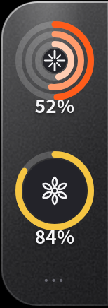
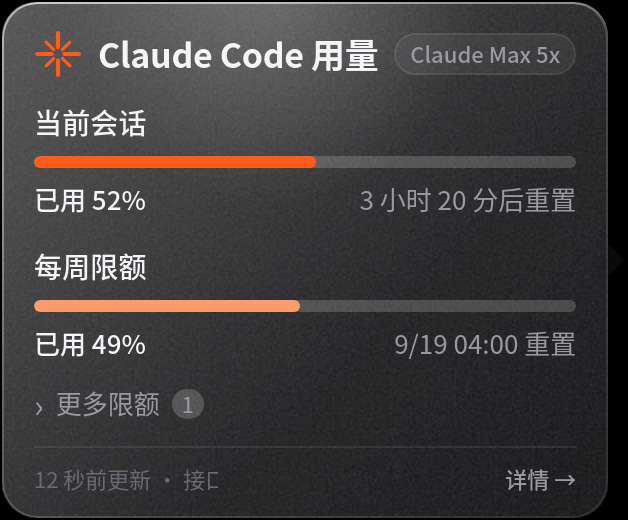
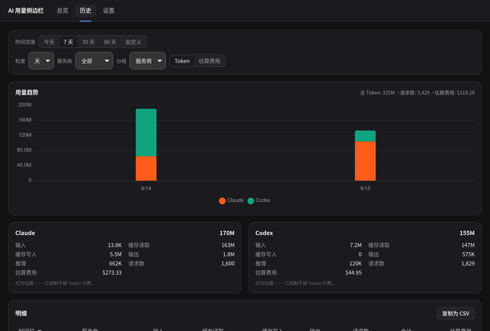
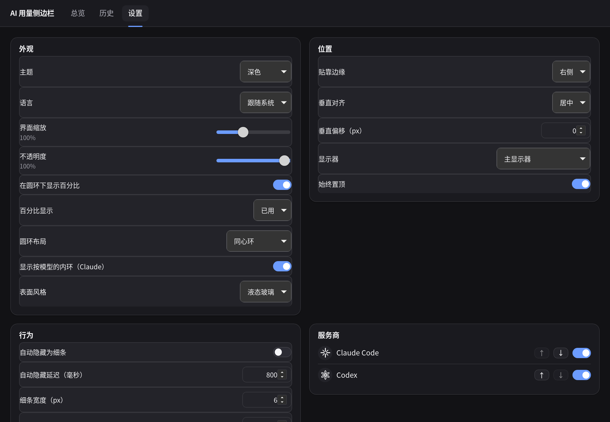

# AI Usage Sidebar

> An always-on-top edge sidebar that shows your **Claude Code** and **OpenAI Codex**
> (and, experimentally, GitHub Copilot and OpenRouter) rate-limit quotas at a glance — one ring per provider, a detail popover on hover,
> and a dashboard with your local token-usage history.

[中文说明见下 ↓](#ai-使用量侧边栏)

---

## Screenshots

Real captures from CachyOS / GNOME (XWayland), dark theme, liquid-glass surface. They
predate v0.6, so newer elements (reset countdowns, forecast arcs, the History
sub-views, the Settings cards) are not in them:

<p align="center">
  
  
</p>
<p align="center">
  
  
</p>

## What it is

`AI Usage Sidebar` is a small desktop widget built with **Tauri 2 (Rust)** and
**SvelteKit / Svelte 5**. It lives on the edge of your screen, above other windows,
and answers one question without interrupting you: *how much of my Claude / Codex
quota is left, and when does it reset?*

* One **progress ring per provider** (or one per window in `ringMode: "all"`).
* Hovering a ring opens a **popover** with every rate-limit window — 5-hour,
  weekly, per-model — plus its reset time. The popover never steals keyboard focus.
* A **dashboard** window holds settings and the **token-usage history** parsed from
  the providers' own local session logs, so you can compare plans and providers
  over time (with an *indicative* API-price estimate).
* A **tray icon** with live usage lines, to show/hide the bar, refresh, pause
  polling, start focus mode, open the dashboard or quit.
* Optional **alerts** (native notification and webhook) and a **`--print`
  command** that hands the numbers to a status line.

## Features

**The bar**

| | |
|---|---|
| Edge docking | Any of the four screen edges, positioned along it (start / centre / end) with a pixel offset, on any monitor. Top and bottom turn the bar into a horizontal strip |
| Drag to move | Drag the bar anywhere: it snaps to the nearest screen edge of the monitor you drop it on and remembers its position along that edge |
| Auto-hide | The bar collapses to a thin handle when you move the pointer away and expands on hover. The collapsed handle is segmented per provider and coloured by severity |
| Labels | `labelContent`: the percentage, the reset countdown ("1h12") or both under each ring; `percentPosition` puts the percentage below the ring or in its centre instead of the provider logo |
| Mini-bars | `ringStyle: "bar"` draws each provider as a logo dot plus one slim bar per window instead of rings |
| Forecast arc | A dashed arc from the current value to where the projection lands at reset, and an hourglass badge when a window is on pace to run out. From the recorded quota samples, falling back to your token rate when the samples are too few |
| Animations | One-shot pulse when a ring crosses the warning / critical level, a flash on a reset (`sidebarAnimations`; off under reduced motion) |
| Popover | Hover a ring for every window with its reset time and a 24 h sparkline. Click a ring to pin it (a pinned popover closes 8 s after the pointer left); click again to close. Any popover closes after `popoverTimeoutSec` (default 10 s) without pointer activity. It never steals keyboard focus |
| Keyboard and screen readers | Focus rings, full ring labels (status, reset time, forecast) and dialog / meter semantics in the popover |
| Always on top | Re-asserted after every map on X11, visible on all workspaces |
| Surfaces | `glass` uses a real blurred backdrop where the OS has one (macOS vibrancy, Windows acrylic, KWin on X11); `solid` is opaque; `cyber` is a neon sci-fi HUD (chamfered plate, scanlines, tick-mark rings, segmented bars) repainted by `cyberAccent`: `neon`, `matrix`, `amber`, `ice`, `synthwave` |
| Themes and i18n | Dark / light / follow the system; English and 简体中文 (tray menu included); colours and sizes are tunable |
| Global shortcuts | Optional keys to show/hide the bar and open the dashboard (X11/XWayland, Windows, macOS; not native Wayland) |
| Autostart | Optional login item (`--hidden`) |

**Tray**

| | |
|---|---|
| Menu | Show/hide the bar, always-show toggle, refresh, open the dashboard or Settings, check for updates, pause polling, quit. On Linux the icon has a menu only (a left click is not delivered) |
| Usage lines | One line per provider and account at the top of the menu (`Claude · 5h 73% · resets in 51 min`), a tooltip naming the busiest window (not on Linux), and a severity dot on the icon (Windows / Linux) |
| Percent mode | `trayDisplay: "percent"` puts the busiest window's number in the tray: the menu-bar title on macOS, drawn into the icon on Windows and Linux |
| Presets and focus mode | A Presets submenu (four built-in presets plus your own) and a Focus submenu (1 hour, until tomorrow 08:00, until turned off) that silences every notification channel and can hide the bar |

**Dashboard**

| | |
|---|---|
| Overview | Per-provider cards with plan and windows, a today summary, last week's summary, a getting-started card while no provider is signed in |
| History: usage | Incremental ingestion of session logs into SQLite. KPI tiles with period-over-period change, per-model and reasoning-effort mix, token composition and cache-hit trend, project ranking, per-day/-week/-month totals with drill-down and Top-N, a 26-week activity heatmap or weekday × hour punch card. Native CSV save and clipboard copy |
| History: quota | Per-cycle peaks with warning / critical lines, limit-hit counts, forecast projection and "1 % of quota ≈ N tokens" per window |
| History: cost | Optional API-equivalent price estimate (a comparison indicator, never an invoice), monthly budget line (`monthlyBudgetUsd`), subscription ROI (`subscriptionUsd`), and a notice when the built-in price table is older than 60 days |
| Sessions | Named sessions, local aliases, real pagination and filters; opt-in prompts, responses, turn metrics and parent/child agents. An **Insights** view adds cost and active-time distributions, a turns-versus-cost scatter, top lists for expensive or failure-prone sessions and tool usage (metadata only). [Details](docs/SESSIONS.md) |
| On-demand AI assessment | Editable send preview, prompt feedback, requirement evidence and efficiency notes; cached reports with separate human review. [Setup](docs/SESSIONS.md) |
| Command palette | `Ctrl+K` / `Cmd+K`: jump to any page or Settings card, refresh, rescan, pause polling, start focus mode, apply a preset, copy diagnostics, export CSV, open the log folder, or flip a setting by name |
| Share card | Renders this month's rings, tokens, estimated cost (labelled an estimate, optionally hidden) and top model as a 1200x630 PNG to copy or save. No account e-mail is ever drawn |
| Onboarding | A first-run wizard (language, theme, screen edge, providers), "What's new" after an update, and "Skip this version" on the update banner |

**Settings**

| | |
|---|---|
| Finding things | A search box, a sticky section index, per-card and global "restore defaults". Only the everyday settings show by default; **Show advanced settings** (a switch above the index) reveals the rest, and a search always finds them. Which is which: [docs/SETTINGS-AUDIT.md](docs/SETTINGS-AUDIT.md) |
| Presets | Four built-in presets (minimal, power, screen share, cyber) and up to ten of your own, with a preview of what changes |
| Undo, import and export | The last 5 versions of `settings.json` can be restored (an edit burst counts as one); settings export to and import from a file |
| Backup and restore | A full backup (settings plus a consistent copy of the usage database); a restore is validated, staged and applied at the next start, keeping the replaced files |
| Diagnostics and privacy | A copyable, redacted diagnostics report (e-mails always masked, no tokens), a "Privacy & network" card listing every outbound request and every file the app keeps, and `hideAccountEmail` to mask addresses everywhere |
| Shortcuts | A shortcut recorder that reports why a key could not be registered |

**Alerts and integrations**

| | |
|---|---|
| Notifications | Optional, **off by default** (master switch `notifications`): a warning when a window crosses your editable warning / critical level (once per window, level and cycle), a heads-up when a window is on pace to run out early, 80 % / 100 % of your monthly budget *estimate*, and a Monday summary of last week. Focus mode silences everything |
| Webhook | An optional second channel (generic JSON, ntfy or Slack-compatible; `https` only, the URL is never logged) and a "send test" button |
| Status lines | `ai-usage-sidebar --print [--format json\|line\|statusline] [--provider ID]` prints your quotas from a snapshot file, for Claude Code's `statusLine`, tmux, polybar or waybar. [Details](docs/STATUSLINE.md) |
| Providers | Claude Code and Codex (verified); GitHub Copilot and OpenRouter (experimental, never tested against a live account) |
| Multiple accounts | Track extra Claude Code and Codex logins (up to 6) next to the primary one: each has its own ring group, quota history, forecast, and its own token, cost and session history (read from that login's own log folder). See the note under *Providers* |

## Providers

| Provider | Verification | Plan | Rate-limit windows shown |
|---|---|---|---|
| Claude Code (OAuth) | verified against a live account | Pro | 5-hour session **+** weekly (all models) |
| Claude Code (OAuth) | verified against a live account | Max 5× / Max 20× | 5-hour session **+** weekly, plus per-model weekly windows (e.g. Opus) when the API reports them |
| OpenAI Codex (ChatGPT login) | verified against a live account | Plus | 5-hour **+** weekly |
| OpenAI Codex (ChatGPT login) | verified against a live account | Pro 20x (`pro`) / Pro 5x (`prolite`) | API-reported windows, including weekly-only responses |
| OpenAI Codex | verified against a live account | Team / Business / Enterprise / Edu | whatever the API reports, classified by window length |
| OpenAI Codex | verified against a live account | API-key mode (`auth_mode: "apikey"`) | no quota windows exist; the ring shows "not signed in" |
| GitHub Copilot | **experimental — never tested against a live account** | Pro / Pro+ / Business / Enterprise | monthly premium-request pool; chat and completions are unmetered on paid plans |
| GitHub Copilot | **experimental — never tested against a live account** | Free | monthly chat **+** completions counts (there is no premium pool to meter) |
| GitHub Copilot | **experimental — never tested against a live account** | organisation-managed seat | GitHub reports no per-seat quota; the popover says so instead of showing 0 % |
| OpenRouter | **experimental — not verified against a live account** | API key from an environment variable | "Credits" window from the key's limit, or the account balance when the key has none; opt-in, off by default |

Window kinds are **detected from the API**, never assumed: a window is classified
by its `limit_window_seconds` (≤ 6 h → 5-hour, ~7 d → weekly, anything else →
"other"). A weekly window can be *primary*; plan names never decide which
windows are present. The table describes observed payloads, not guaranteed plan entitlements.

**Several accounts.** Claude Code and Codex can be tracked for more than one login
(a personal and a work account, say): add them under Settings → Accounts (turn on *Show advanced settings* first), up to 6,
each pointing at that login's CLI config directory (`CLAUDE_CONFIG_DIR` /
`CODEX_HOME`). Extra accounts get their own rings, popover rows, quota history and
forecast, and their local session logs are ingested from that folder too: History
(with an account selector and an `account` CSV column once an extra account
exists), cost, sessions, the subscription ROI (one plan price per account) and
the tokens-per-percent cycles are per account. The monthly budget alerts and the
weekly summary total every account (the summary also lists each one). Removing an
account keeps everything already stored. On macOS an extra Claude account is read
from `<dir>/.credentials.json`, else from the Keychain item Claude Code files for
that folder (`Claude Code-credentials-<8 hex of sha256(folder)>`, derived from
third-party reports; see docs/PROVIDERS.md §5, a wrong guess just finds nothing).

**About "experimental".** The Claude and Codex providers were built by
inspecting real responses from real accounts. The Copilot provider was built
only from other projects' published source code and GitHub's own Copilot SDK
documentation — the author has no Copilot subscription and could never run it
against one. It is therefore **off by default** unless Copilot credentials are
already on your disk, it is badged *Experimental* in Settings → Providers, and
its numbers may be wrong or stop working without notice. Every claim behind it,
with links to the source lines it came from, is in
[docs/PROVIDERS.md](docs/PROVIDERS.md) — which also records why **Gemini CLI**
and **Cursor** were researched and *not* implemented. Corrections from someone
with a live Copilot account are very welcome. **OpenRouter** is experimental for the
same reason (built from its public API reference, no key to test with); it is off
until you enable it and reads its API key from an environment variable.

## How it reads your data

Everything happens on your machine. The app reads the credentials the official
CLIs already wrote, calls the same quota endpoints the CLIs call (for OpenRouter,
its documented API), and parses the session logs those CLIs leave on disk.

**Credentials**

| Provider | Location |
|---|---|
| Claude | `~/.claude/.credentials.json` (Linux, Windows) · macOS Keychain item `Claude Code-credentials` · override the directory with `CLAUDE_CONFIG_DIR` |
| Codex | `~/.codex/auth.json` · override the directory with `CODEX_HOME` |
| GitHub Copilot | `~/.config/github-copilot/apps.json` (older `hosts.json`), written by the Copilot editor plugins · `%LOCALAPPDATA%\github-copilot\` on Windows · `$XDG_CONFIG_HOME` is honoured. The GitHub CLI's token is deliberately **not** used. |
| OpenRouter | no file: the API key is read from the environment variable named by `openrouterKeyEnv` (default `OPENROUTER_API_KEY`); the key itself is never stored |

**Endpoints**

| Provider | Request |
|---|---|
| Claude | `GET https://api.anthropic.com/api/oauth/usage` (and `/api/oauth/profile` for the plan label), `Authorization: Bearer …`, `anthropic-beta: oauth-2025-04-20` |
| Codex | `GET https://chatgpt.com/backend-api/wham/usage`, `Authorization: Bearer …`, `ChatGPT-Account-Id: …` |
| GitHub Copilot | `GET https://api.github.com/copilot_internal/user`, `Authorization: token …`, `X-Github-Api-Version: 2025-04-01` — the call the Copilot editor extensions make |
| OpenRouter | `GET https://openrouter.ai/api/v1/key` (and `/api/v1/credits` for a key without a limit), `Authorization: Bearer …` |

**Local logs (token history, and a fallback when you are offline)**

| Provider | Location |
|---|---|
| Claude | `~/.claude/projects/**/*.jsonl` |
| Codex | `~/.codex/sessions/YYYY/MM/DD/rollout-*.jsonl`, `~/.codex/archived_sessions/**` |
| GitHub Copilot | none — no Copilot client is known to log token counts, so Copilot has no token history |
| OpenRouter | none — it is an API gateway, so there is no token history |

The primary Claude Code and Codex accounts and every enabled extra account are ingested, each from its own log folder.

> **Privacy.** Your tokens never leave your machine except in the request to
> Anthropic's, OpenAI's, GitHub's and OpenRouter's own endpoints — the same ones
> `claude`, `codex` and the Copilot editor extensions already talk to, and only for
> a provider you have switched on. There is no telemetry. The only other outbound
> requests are the daily GitHub release check, the price-table check, a webhook you
> configure yourself and an AI evaluation you send; Settings → Privacy & network
> lists them all, and a settings switch turns off each automatic one. Session JSONL records are
> parsed locally to index usage, titles, turns, tool counters and message locations;
> the index does not copy conversation bodies. **Sessions → Local content** is off
> by default and must be enabled to display prompts or derive title excerpts.
> **AI evaluation is optional:** only pressing Send transmits the reviewed preview
> to your configured endpoint. Reports and that preview's cache key are retained
> locally (up to 100 reports); disabling Local content clears them. API keys are
> read from a named environment variable and are never stored in app settings.
> See [Session analysis](docs/SESSIONS.md) for data boundaries and setup.
>
> Price checks are controlled separately from provider polling. With the
> default empty **Pricing table URL**, the app checks the project's
> [GitHub raw pricing.json](https://raw.githubusercontent.com/harveyxiacn/AI-usage-monitor-sidebar/main/pricing.json)
> source. A non-empty value selects a custom `https://` source. When
> **Automatic price checks** is enabled, a check runs about 60 seconds after
> startup and then once a day; it only reports that a newer source table is
> available. It never changes the applied table by itself.

## Install

> **Let your AI agent do it.** Tell Claude Code, Codex or any coding agent:
> *"Install and set up AI Usage Sidebar by following
> https://github.com/harveyxiacn/AI-usage-monitor-sidebar/blob/main/AGENTS.md"*.
> [`AGENTS.md`](AGENTS.md) covers platform detection, download or source build,
> verification, every setting and uninstalling.

### Releases

Download the installer for your platform from the
[latest release](https://github.com/harveyxiacn/AI-usage-monitor-sidebar/releases/latest):
`.deb` / `.rpm` / `.AppImage` (Linux x86_64), `.dmg` (macOS, Apple Silicon and
Intel), `-setup.exe` / `.msi` (Windows x64).

Package managers (**once published** — see
[`docs/RELEASING.md`](docs/RELEASING.md); until a channel is enabled, use the
release assets above):

```sh
winget install harveyxiacn.AIUsageSidebar              # Windows
scoop bucket add harveyxiacn https://github.com/harveyxiacn/scoop-bucket && scoop install ai-usage-sidebar
brew install --cask harveyxiacn/tap/ai-usage-sidebar   # macOS
yay -S ai-usage-sidebar-bin                            # Arch / CachyOS / Manjaro
```

Unless a release says otherwise, builds are unsigned: macOS needs
`xattr -dr com.apple.quarantine "/Applications/AI Usage Sidebar.app"` and
Windows shows a SmartScreen warning. Releases built with signing secrets
configured (Authenticode, Developer ID + notarization) do not need either
step; the release notes say which kind you are getting.

### Staying up to date

The app checks GitHub for a newer release once a day (Settings → Updates →
*Check for updates daily*, on by default) and never installs anything on its
own: a new version shows up as a tray item, a one-line banner in the dashboard
and an *Updates* row under Settings → About, where "Install and restart" is a
deliberate click. Copies installed from a `.deb`/`.rpm` or by
`scripts/install-linux.sh` are owned by the package manager, so they get a
link to the release page instead of an in-place install. Maintainers: see
[`docs/RELEASING.md`](docs/RELEASING.md). Manifest templates for winget, Homebrew, Scoop
and the AUR live in [`packaging/`](packaging/README.md).

### Build prerequisites

**CachyOS / Arch**

```sh
sudo pacman -S --needed webkit2gtk-4.1 libayatana-appindicator librsvg base-devel rustup nodejs pnpm
rustup default stable
```

**Debian / Ubuntu**

```sh
sudo apt update
sudo apt install -y libwebkit2gtk-4.1-dev libayatana-appindicator3-dev librsvg2-dev \
  patchelf libgtk-3-dev libsoup-3.0-dev libjavascriptcoregtk-4.1-dev \
  build-essential curl wget file libssl-dev
curl --proto '=https' --tlsv1.2 -sSf https://sh.rustup.rs | sh
corepack enable pnpm
```

**macOS** — Xcode command line tools (`xcode-select --install`), Rust
(`rustup`), Node 22+ and pnpm. macOS 11 or newer.

**Windows** — Visual Studio Build Tools (C++ desktop workload),
[WebView2 runtime](https://developer.microsoft.com/microsoft-edge/webview2/)
(pre-installed on Windows 11), Rust and Node 22+ / pnpm.

GNOME users on Linux also want the
[AppIndicator extension](https://extensions.gnome.org/extension/615/appindicator-support/)
for the tray icon.

**Any Linux, without a package** — `scripts/install-linux.sh` builds a release
binary and installs it for the current user (`~/.local/bin`, launcher entry and
icons, no root), so it can be started and pinned from the dock.
`--uninstall` removes it again; settings and history are kept.

## Build & run

```sh
pnpm install
pnpm tauri dev     # development, with hot reload
pnpm tauri build   # release bundles in src-tauri/target/release/bundle/
# Arch / CachyOS: linuxdeploy's strip step fails on current binutils, so build the
# AppImage with `NO_STRIP=true APPIMAGE_EXTRACT_AND_RUN=1 pnpm tauri build --bundles appimage`
```

Useful environment variables:

| Variable | Effect |
|---|---|
| `AI_USAGE_SIDEBAR_BACKEND=wayland` | Do **not** force XWayland (see below) |
| `AI_USAGE_SIDEBAR_LOG=debug` | Verbose logging, including every window placement |
| `AI_USAGE_SIDEBAR_DEVTOOLS=1` | Open the WebKit inspector in debug builds |
| `CLAUDE_CONFIG_DIR`, `CODEX_HOME` | Point the app at non-default CLI directories |

## Platform notes

* **Linux / GNOME Wayland (primary development target).** Wayland does not let a
  client position its own windows or keep them above others, so the app forces
  `GDK_BACKEND=x11` (XWayland) unless you set `AI_USAGE_SIDEBAR_BACKEND=wayland`.
  With the proprietary NVIDIA driver it also sets
  `WEBKIT_DISABLE_DMABUF_RENDERER=1`, without which WebKitGTK renders black.
* **KDE / wlroots (Hyprland, Sway).** Native Wayland docking through the
  `wlr-layer-shell` protocol is opt-in (`AI_USAGE_SIDEBAR_BACKEND=wayland`, needs
  `gtk-layer-shell`) and falls back to XWayland by itself; it has not been run on a
  real wlroots or KDE session yet. Linux has no client-side blur on GNOME, so the
  glass surface is the webview's own translucent fill; under X11/XWayland KWin
  blurs behind the bar.
* **Linux tray and shortcuts.** The tray icon has a menu only (left clicks are not
  delivered on Linux; GNOME needs the AppIndicator extension). Global shortcuts work
  on X11/XWayland, Windows and macOS but not on native Wayland, where you bind a
  compositor key instead.
* **macOS.** Builds and runs (Intel + Apple Silicon); the overlay windows use
  `macOSPrivateApi` for transparency and a real `NSVisualEffectView` backdrop
  (HUD material) when `surfaceStyle` is `glass`. Not yet notarised — right-click
  → *Open* on first launch.
* **Windows.** Builds and runs, with the DWM acrylic backdrop for the glass
  surface; the tray icon takes the left-click to toggle the dashboard.
  Considered beta.

Details, including the geometry maths and the hover state machine, are in
[`docs/PLATFORM.md`](docs/PLATFORM.md). The module and command contracts are in
[`docs/ARCHITECTURE.md`](docs/ARCHITECTURE.md).

## Status lines and scripts

Turn on *Settings -> Integrations -> Export snapshot file* (an advanced card:
switch on *Show advanced settings*) and
`ai-usage-sidebar --print [--format json|line|statusline]` prints your quotas
from the terminal (exit code 2 when the data is missing or stale). That makes
them usable in Claude Code's `statusLine`, tmux, polybar or waybar — see
[`docs/STATUSLINE.md`](docs/STATUSLINE.md). *Pause polling* lives in the same
card; *Backup & history* makes and restores backups of your settings
and history.

## Keeping prices up to date

The cost column is an *estimate* for comparing providers and plans —
subscriptions do not bill per token. Prices come from a built-in table
(checked 2026-09-23). Model names drift fast, so:

* A model the table does not know is priced from its **closest known family**
  (`gpt-5.3-codex-spark` → `gpt-5.3-codex`, `claude-opus-4-99` →
  `claude-opus-4`). Those numbers are approximate and the dashboard says so.
  A model from an unrelated family stays unpriced and shows "—".
* You can edit any row, add your own prefixes and delete rows in
  **Settings → Updates** (advanced settings). Your table wins over everything else.
* The project-maintained GitHub raw `pricing.json` is the default source when
  **Pricing table URL** is empty. Set a non-empty `https://` URL to use a
  custom source instead. An empty URL no longer disables price checks.
* **Automatic price checks** (`autoPricingCheck`, on by default) run about 60
  seconds after startup and once every 24 hours. They only check for a newer
  source table and show a reminder; they do not apply prices or restart the
  app. The program update switch (`autoUpdateCheck`) is independent and only
  checks for new application releases.
* Click **Check pricing updates** to fetch the selected source and inspect its
  revision. If an update is available, click **Apply price update** to apply
  it. Checking never changes the applied table. A saved table edited in
  **Settings → Updates** always has priority; click **Use source pricing** to
  explicitly switch away from it, confirm the change and back up the saved
  table first. Downloads are capped in size, strictly validated and cached; an
  invalid source is rejected and the current table remains in use.

The file must use the same schema as [`pricing.json`](pricing.json) in this
repository, which you can host yourself:

```json
{
  "updatedAt": "2026-09-23T00:00:00Z",
  "entries": [
    { "modelPattern": "gpt-6-sol", "inputPerM": 2.0, "outputPerM": 10.0,
      "cacheWritePerM": 2.5, "cacheReadPerM": 0.2 }
  ]
}
```

Rates are USD per 1M tokens. To follow this project's own list:

```
https://raw.githubusercontent.com/harveyxiacn/AI-usage-monitor-sidebar/main/pricing.json
```

The built-in defaults were checked against the [OpenAI pricing](https://developers.openai.com/api/docs/pricing),
[GPT-6 Sol](https://developers.openai.com/api/docs/models/gpt-6-sol),
[GPT-6 Luna](https://developers.openai.com/api/docs/models/gpt-6-luna),
[Claude pricing](https://platform.claude.com/docs/en/about-claude/pricing), and
[Claude Opus 5.5](https://www.anthropic.com/claude-opus-5-5) pages.

## Where your configuration lives

| | Linux | macOS | Windows |
|---|---|---|---|
| Settings | `~/.config/io.github.harveyxiacn.ai-usage-sidebar/settings.json` | `~/Library/Application Support/io.github.harveyxiacn.ai-usage-sidebar/settings.json` | `%APPDATA%\io.github.harveyxiacn.ai-usage-sidebar\settings.json` |
| Database & cache | `~/.local/share/io.github.harveyxiacn.ai-usage-sidebar/usage.db` | `~/Library/Application Support/io.github.harveyxiacn.ai-usage-sidebar/usage.db` | `%LOCALAPPDATA%\io.github.harveyxiacn.ai-usage-sidebar\usage.db` (or `%APPDATA%\…` if an older version already created it there) |
| Logs | `~/.local/share/io.github.harveyxiacn.ai-usage-sidebar/logs/` | `~/Library/Logs/io.github.harveyxiacn.ai-usage-sidebar/` | `%LOCALAPPDATA%\io.github.harveyxiacn.ai-usage-sidebar\logs\` |

Deleting `settings.json` resets the app to its defaults (right edge, vertically
centred, always visible, dark theme). The settings folder also holds
`settings.history.json` (the undo ring); the data folder holds `snapshot.json` (when
exported), `alerts-state.json` (which alerts already fired) and, after a restore,
`pre-restore/`. Every key of `settings.json` is listed in [`AGENTS.md`](AGENTS.md).

## Roadmap

- [x] `wlr-layer-shell` docking for KDE / Hyprland / Sway — opt-in, never run on real hardware yet
- [x] Blur behind the bar on KWin (X11 / XWayland)
- [x] GitHub Copilot (experimental, unverified — see [docs/PROVIDERS.md](docs/PROVIDERS.md))
- [x] OpenRouter (experimental, unverified)
- [x] Multiple Claude Code / Codex accounts (quota, token history, cost, sessions)
- [x] Native CSV export and clipboard copy
- [x] Per-project token breakdown
- [x] Burn-rate forecast ("at this rate your weekly window runs out in …")
- [x] Alerts: threshold, forecast, budget, weekly summary, webhook
- [ ] Budget alerts per account (the monthly budget covers all accounts)
- [ ] Verify Copilot, OpenRouter and native Wayland on real accounts and hardware
- [ ] Gemini CLI — blocked on its move to OS-keychain credential storage ([why](docs/PROVIDERS.md))
- [ ] ~~Cursor~~ — not planned: ToS and endpoint stability ([why](docs/PROVIDERS.md))
- [ ] A menu-bar-only mode on macOS (the tray can already show the percentage)
- [ ] Notarised macOS builds and a signed Windows installer

## Contributing

Issues and pull requests are welcome. Please read `docs/ARCHITECTURE.md` first —
it is the contract for module boundaries, shared types, commands and events.
Before opening a PR:

```sh
pnpm check
pnpm check:i18n
pnpm check:agents
pnpm test
pnpm exec playwright install chromium
pnpm test:e2e
cd src-tauri && cargo fmt --all -- --check && cargo clippy --locked --all-targets -- -D warnings && cargo test --locked
```

Never paste real tokens into an issue; redact `accessToken` / `refresh_token`
from any log you attach.

See [validation notes](docs/VALIDATION.md) for regression coverage and native
platform limitations, and [pricing assumptions](docs/ARCHITECTURE.md#9-cost-estimation)
for the sources and limits of cost estimates. Unknown model prices display `—`;
mixed totals do not silently omit those costs. The browser preview is marked
as sample data and never reads desktop credentials.

## License

MIT © Harvey Xia. See [LICENSE](LICENSE).

---

# AI 使用量侧边栏

> 一个常驻屏幕边缘、置顶显示的小挂件，一眼看清 **Claude Code** 与 **OpenAI Codex**
>（以及实验性的 GitHub Copilot 与 OpenRouter）的额度用量：每个服务一个进度环，悬停弹出详情，仪表盘里还有本地 token 使用历史。

## 截图

在 CachyOS / GNOME（XWayland）上的真实截图，深色主题、液态玻璃表面。截图早于 v0.6，
因此不含较新的元素（重置倒计时、预测弧、历史子页、设置卡片）：

<p align="center">
  
  
</p>
<p align="center">
  
  
</p>

## 这是什么

`AI Usage Sidebar` 用 **Tauri 2（Rust）** + **SvelteKit / Svelte 5** 编写，
常驻屏幕边缘、置顶于其他窗口之上，只回答一个问题：*我的 Claude / Codex 额度
还剩多少、什么时候重置？*

* 每个服务一个**进度环**（`ringMode: "all"` 时每个限额窗口一个环）。
* 悬停某个环会弹出**详情层**，列出全部限额窗口——5 小时、每周、按模型——以及各自的重置时间。弹层**不会抢走键盘焦点**。
* **仪表盘**窗口提供设置，以及从各 CLI 本地会话日志解析出来的 **token 使用历史**，方便横向比较不同套餐与服务（并给出仅供参考的 API 等价费用估算）。
* **托盘图标**：带实时用量行，可显示/隐藏侧边栏、立即刷新、暂停轮询、开启专注模式、打开仪表盘、退出。
* 可选的**提醒**（系统通知与 Webhook），以及把数字交给状态栏的 **`--print` 命令**。

## 功能

**侧栏**

| | |
|---|---|
| 边缘吸附 | 四条屏幕边缘任选，沿边缘对齐（起始/居中/末端）并可设像素偏移，可指定显示器；贴靠顶部或底部时侧栏会变成横条 |
| 拖拽移动 | 直接拖动侧栏：松手后吸附到所在显示器最近的一条边缘，并记住沿该边缘的位置 |
| 自动隐藏 | 鼠标离开后收起为细条，悬停时自动展开；收起的把手按服务商分段，并按严重程度着色 |
| 标签 | `labelContent`：圆环下显示百分比、重置倒计时（如“1h12”）或两者；`percentPosition` 可将百分比放在圆环下方，或放进圆心以替代服务商图标 |
| 迷你条 | `ringStyle: "bar"`：每个服务商显示为一个图标点加每个窗口一条细进度条，而不是圆环 |
| 预测弧 | 一条虚线弧从当前值延伸到重置时预计落点，预计提前用尽时显示沙漏徽标。依据已记录的额度样本；样本过少时回退为按 token 速率估算 |
| 动画 | 越过警告/严重阈值时圆环脉冲一次，重置时闪光一次（`sidebarAnimations`；系统开启“减少动态效果”时关闭） |
| 弹层 | 悬停圆环查看各窗口、重置时间与 24 小时 sparkline。点击圆环可固定弹层（固定后鼠标离开 8 秒自动关闭），再次点击立即关闭；任何弹层在 `popoverTimeoutSec`（默认 10 秒）内无鼠标活动也会关闭。弹层不会抢走键盘焦点 |
| 键盘与读屏 | 焦点环、完整的圆环标签（状态、重置时间、预测），弹层具备 dialog / meter 语义 |
| 始终置顶 | X11 下每次映射后重新置顶，并在所有工作区可见 |
| 表面风格 | `glass` 在系统支持时使用原生毛玻璃（macOS vibrancy、Windows acrylic、X11 下的 KWin 模糊）；`solid` 不透明；`cyber` 是霓虹科幻 HUD（切角面板、扫描线、刻度式圆环、分段进度条），由 `cyberAccent` 换色：`neon`、`matrix`、`amber`、`ice`、`synthwave` |
| 主题与多语言 | 深色 / 浅色 / 跟随系统；English 与简体中文（含托盘菜单）；颜色与尺寸可调 |
| 全局快捷键 | 可选：显示/隐藏侧栏、打开仪表盘（X11/XWayland、Windows、macOS；原生 Wayland 不支持） |
| 开机自启 | 可选登录项（带 `--hidden` 参数） |

**托盘**

| | |
|---|---|
| 菜单 | 显示/隐藏侧栏、常驻显示开关、立即刷新、打开仪表盘或设置、检查更新、暂停轮询、退出。Linux 下图标只有菜单（左键点击不会送达应用） |
| 用量行 | 菜单顶部按服务商与账号各一行（`Claude · 5h 73% · 51 分钟后重置`），提示文字给出最忙的窗口（Linux 上无），图标上带严重度圆点（Windows / Linux） |
| 百分比模式 | `trayDisplay: "percent"` 把最忙窗口的数字放进托盘：macOS 为菜单栏标题，Windows 与 Linux 画入图标 |
| 预设与专注模式 | “预设”子菜单（四个内置预设加你自己的）；“专注”子菜单（1 小时、到明天 08:00、直到手动关闭）会静默所有通知渠道，也可同时隐藏侧栏 |

**仪表盘**

| | |
|---|---|
| 概览 | 每个服务商的卡片（套餐、窗口）、今日概览、上周摘要，以及尚无服务商登录时的入门卡片 |
| 历史：用量 | 增量解析会话日志入 SQLite。带环比的 KPI 磁贴、模型与推理强度构成、Token 构成与缓存命中率趋势、项目排行、按日/周/月统计（支持下钻与 Top-N）、26 周活跃热力图或星期×小时图。原生 CSV 保存与复制 |
| 历史：配额 | 按配额周期的峰值图（含警告/严重阈值线）、撞限次数、预测投影，以及每个窗口“1% 配额 ≈ N token” |
| 历史：成本 | 可选的 API 等价费用估算（仅作横向参考，不是账单）、月度预算线（`monthlyBudgetUsd`）、订阅回报（`subscriptionUsd`），内置价目表超过 60 天时会提示 |
| 会话 | 原生名称、本地别名、后端分页与筛选；按需开启提示词、回复、轮次指标及父子 Agent 展示。**洞察**视图提供费用与活跃时长分布、轮次×费用散点、昂贵或易失败会话的排行与工具使用情况（仅用元数据）。[详情](docs/SESSIONS.md) |
| 按需 AI 评测 | 发送前可编辑预览，评估提示词、需求证据与效率；缓存报告，区分 AI 判断与人工确认。[配置说明](docs/SESSIONS.md) |
| 命令面板 | `Ctrl+K` / `Cmd+K`：跳转任意页面或设置卡片、刷新、重新扫描、暂停轮询、开启专注模式、应用预设、复制诊断信息、导出 CSV、打开日志目录，或按名称切换某个设置 |
| 分享卡片 | 生成 1200×630 的 PNG（本月圆环、Token、估算费用——标注为估算，可隐藏——与最常用模型），可复制或保存；绝不绘制账号邮箱 |
| 引导 | 首次运行向导（语言、主题、屏幕边缘、服务商）、更新后的“新功能”，以及更新横幅上的“跳过此版本” |

**设置**

| | |
|---|---|
| 查找 | 搜索框、吸附式分区导航、分卡与全部“恢复默认” |
| 预设 | 四个内置预设（极简、进阶、屏幕共享、赛博）和最多十个自定义预设，应用前可预览改动 |
| 撤销、导入与导出 | 可恢复最近 5 个版本的 `settings.json`（连续编辑算一次）；设置可导出为文件或从文件导入 |
| 备份与恢复 | 完整备份（设置加一致的用量数据库副本）；恢复前先校验并暂存，下次启动时应用，被替换的文件会保留 |
| 诊断与隐私 | 可复制且已脱敏的诊断报告（邮箱始终遮盖，不含令牌）、列出所有外发请求与本地文件的“隐私与网络”卡片，以及在各处遮盖邮箱的 `hideAccountEmail` |
| 快捷键 | 快捷键录制器，无法注册时会说明原因 |

**提醒与集成**

| | |
|---|---|
| 通知 | 可选，**默认关闭**（总开关 `notifications`）：窗口越过可编辑的警告/严重阈值时提醒（每个窗口、级别与周期一次）、预计提前用尽时提醒、月度预算*估算*达 80% / 100% 时提醒，以及每周一的上周摘要。专注模式会静默全部渠道 |
| Webhook | 可选的第二渠道（通用 JSON、ntfy 或兼容 Slack；仅 `https`，URL 不写入日志），并带“发送测试” |
| 状态栏 | `ai-usage-sidebar --print [--format json\|line\|statusline] [--provider ID]` 从快照文件输出额度，用于 Claude Code 的 `statusLine`、tmux、polybar、waybar。[详情](docs/STATUSLINE.md) |
| 服务商 | Claude Code 与 Codex（已验证）；GitHub Copilot 与 OpenRouter（实验性，从未在真实账号上测试） |
| 多账号 | 在主账号之外再跟踪最多 6 个 Claude Code / Codex 登录：各有自己的圆环组、配额历史与预测，以及各自独立的 token、费用与会话历史（从该登录自己的日志目录读取），见“支持的服务与套餐”下的说明 |

## 支持的服务与套餐

| 服务 | 验证情况 | 套餐 | 显示的限额窗口 |
|---|---|---|---|
| Claude Code（OAuth） | 已在真实账号上验证 | Pro | 5 小时会话 **+** 每周（全模型） |
| Claude Code（OAuth） | 已在真实账号上验证 | Max 5× / Max 20× | 5 小时会话 **+** 每周，API 返回时还包括按模型（如 Opus）的每周窗口 |
| OpenAI Codex（ChatGPT 登录） | 已在真实账号上验证 | Plus | 5 小时 **+** 每周 |
| OpenAI Codex（ChatGPT 登录） | 已在真实账号上验证 | Pro 20x（`pro`）/ Pro 5x（`prolite`） | 以 API 返回为准，兼容仅返回每周窗口的情况 |
| OpenAI Codex | 已在真实账号上验证 | Team / Business / Enterprise / Edu | 以 API 返回为准，按窗口时长归类 |
| OpenAI Codex | 已在真实账号上验证 | API Key 模式（`auth_mode: "apikey"`） | 不存在额度窗口，环显示“未登录” |
| GitHub Copilot | **实验性 —— 从未在真实账号上验证** | Pro / Pro+ / Business / Enterprise | 每月 premium 请求额度池；付费套餐的 chat 与补全不计量 |
| GitHub Copilot | **实验性 —— 从未在真实账号上验证** | Free | 每月 chat **+** 代码补全次数（免费套餐没有 premium 额度池） |
| GitHub Copilot | **实验性 —— 从未在真实账号上验证** | 组织分配的席位 | GitHub 不返回该席位的个人额度，弹窗会如实说明，而不是显示 0% |
| OpenRouter | **实验性 —— 未在真实账号上验证** | 环境变量中的 API Key | 按密钥额度上限显示“Credits”窗口；无上限时显示账户余额；需手动开启，默认关闭 |

窗口类型一律**由 API 返回值判断**，不做假设：按 `limit_window_seconds` 归类
（≤ 6 小时 → 5 小时窗口，约 7 天 → 每周窗口，其余 → 其他）。每周窗口也可能是
*primary*，程序不按套餐名硬编码窗口数量。上表是已观察到的数据形态，不承诺套餐权益。

**多个账号**：Claude Code 与 Codex 可以同时跟踪多个登录（例如个人与工作账号）：在“设置 → 账号”中添加，
最多 6 个，各自指向该登录的 CLI 配置目录（`CLAUDE_CONFIG_DIR` / `CODEX_HOME`）。额外账号有独立的圆环、弹层行、
配额历史与预测，其本地会话日志也会从该目录摄取：历史（出现额外账号后有账号选择器和 CSV 的 `account` 列）、费用、
会话、订阅回报（每个账号一个套餐价格）与“每 1% 的 token 数”周期都按账号统计。每月预算提醒与每周摘要合并所有账号
（摘要中另列各账号）。移除账号会保留已存储的全部数据。macOS 上额外的 Claude 账号先读 `<目录>/.credentials.json`，
否则读 Claude Code 为该目录建立的钥匙串条目（`Claude Code-credentials-<目录 sha256 的前 8 位十六进制>`，来自第三方
报告，见 docs/PROVIDERS.md §5；猜错只会找不到条目）。

**关于“实验性”**：Claude 与 Codex 两个服务商是对着真实账号的真实响应写出来的；
GitHub Copilot 则只依据其他开源项目公开的源码，以及 GitHub 自家 Copilot SDK 的
文档实现——作者没有 Copilot 订阅，无法在真实账号上跑通任何一条路径。因此它
**默认关闭**（除非本机已存在 Copilot 凭据），在「设置 → 服务商」中标注为
*实验性*，其数值可能有误，也可能随时失效。所有结论及其源码出处链接都记录在
[docs/PROVIDERS.md](docs/PROVIDERS.md)，其中也说明了 **Gemini CLI** 与
**Cursor** 为什么调研后*没有*实现。欢迎有 Copilot 账号的朋友帮忙纠正。**OpenRouter** 同样是实验性的（依据其公开 API 文档实现，作者没有可测试的密钥），
需手动开启，API 密钥从环境变量读取。

## 数据从哪里来

统计在本机完成。应用读取官方 CLI 已经写好的凭据，调用 CLI 所用的配额接口（OpenRouter 则调用其公开 API），
并解析这些 CLI 留在磁盘上的会话日志。可选 AI 评测仅在主动发送时调用自行配置的服务。

**凭据**

| 服务 | 位置 |
|---|---|
| Claude | `~/.claude/.credentials.json`（Linux、Windows）· macOS 钥匙串条目 `Claude Code-credentials` · 可用 `CLAUDE_CONFIG_DIR` 覆盖目录 |
| Codex | `~/.codex/auth.json` · 可用 `CODEX_HOME` 覆盖目录 |
| GitHub Copilot | `~/.config/github-copilot/apps.json`（旧版为 `hosts.json`），由 Copilot 编辑器插件写入 · Windows 为 `%LOCALAPPDATA%\github-copilot\` · 支持 `$XDG_CONFIG_HOME`。**不会**使用 GitHub CLI 的令牌。 |
| OpenRouter | 无文件：API 密钥从 `openrouterKeyEnv`（默认 `OPENROUTER_API_KEY`）所指定的环境变量读取，密钥本身从不保存 |

**接口**

| 服务 | 请求 |
|---|---|
| Claude | `GET https://api.anthropic.com/api/oauth/usage`（套餐名另取 `/api/oauth/profile`），请求头 `Authorization: Bearer …`、`anthropic-beta: oauth-2025-04-20` |
| Codex | `GET https://chatgpt.com/backend-api/wham/usage`，请求头 `Authorization: Bearer …`、`ChatGPT-Account-Id: …` |
| GitHub Copilot | `GET https://api.github.com/copilot_internal/user`，请求头 `Authorization: token …`、`X-Github-Api-Version: 2025-04-01` —— 与 Copilot 编辑器插件所调用的一致 |
| OpenRouter | `GET https://openrouter.ai/api/v1/key`（无额度上限的密钥还会请求 `/api/v1/credits`），`Authorization: Bearer …` |

**本地日志（token 历史；离线时也作为额度兜底）**

| 服务 | 位置 |
|---|---|
| Claude | `~/.claude/projects/**/*.jsonl` |
| Codex | `~/.codex/sessions/YYYY/MM/DD/rollout-*.jsonl`、`~/.codex/archived_sessions/**` |
| GitHub Copilot | 无 —— 目前没有任何 Copilot 客户端会把 token 计数写到本地，因此 Copilot 没有 token 历史 |
| OpenRouter | 无 —— 它是 API 网关，没有 token 历史 |

主账号的 Claude Code 与 Codex 以及每个已启用的额外账号都会被解析日志，各自读取自己的日志目录。

> **隐私说明**：除了发往 Anthropic、OpenAI、GitHub 与 OpenRouter 自家接口（也就是 `claude`、
> `codex` 和 Copilot 编辑器插件本来就会访问的那几个，且仅限你已启用的服务商）之外，
> 登录凭据不会离开本机。没有遥测或统计上报。其余外发请求只有：每日一次的 GitHub 新版本检查、价格表检查、
> 你自己配置的 Webhook，以及你主动发送的 AI 评测；“设置 → 隐私与网络”会全部列出，自动发生的几项都有开关可关。会话 JSONL 在本机解析，索引保留用量、标题、轮次、
> 工具计数和消息位置，不复制对话正文。**会话 → 本地内容**默认关闭，开启后才显示提示词或生成标题摘录。
> **AI 评测可选**：仅点击发送时，将你检查过的预览发送到配置的接口。评测报告与预览缓存键在本机保留
> （最多 100 份）；关闭本地内容会清除它们。API Key 仅从指定环境变量读取，不写入应用设置。
> 设置与统计口径见[会话分析说明](docs/SESSIONS.md)。
>
> 价格检查与服务商轮询相互独立。**价格表地址**为空时，应用检查项目维护的
> [GitHub raw pricing.json](https://raw.githubusercontent.com/harveyxiacn/AI-usage-monitor-sidebar/main/pricing.json)；
> 填入非空的 `https://` 地址时，则改用自定义来源。开启**自动检查价格**后，应用会在启动约
> 60 秒后、以及此后每天检查一次；检查只会提示来源表有更新，不会自行改变当前已应用的价格表。

## 安装

> **让 AI agent 代劳。** 对 Claude Code、Codex 或任意编码 agent 说：
> *“按照 https://github.com/harveyxiacn/AI-usage-monitor-sidebar/blob/main/AGENTS.md
> 安装并设置 AI Usage Sidebar”*。
> [`AGENTS.md`](AGENTS.md) 涵盖平台识别、下载或源码构建、启动验证、全部设置项与卸载。

### 下载安装包

从[最新发布](https://github.com/harveyxiacn/AI-usage-monitor-sidebar/releases/latest)下载对应平台的安装包：
Linux x86_64 的 `.deb` / `.rpm` / `.AppImage`，macOS 的 `.dmg`（Apple Silicon 与 Intel 各一个），
Windows x64 的 `-setup.exe` / `.msi`。

包管理器（**发布后可用**，见 [`docs/RELEASING.md`](docs/RELEASING.md)；渠道启用之前请使用上面的发布包）：

```sh
winget install harveyxiacn.AIUsageSidebar              # Windows
scoop bucket add harveyxiacn https://github.com/harveyxiacn/scoop-bucket && scoop install ai-usage-sidebar
brew install --cask harveyxiacn/tap/ai-usage-sidebar   # macOS
yay -S ai-usage-sidebar-bin                            # Arch / CachyOS / Manjaro
```

除非发布说明另有说明，构建默认未签名：macOS 需执行
`xattr -dr com.apple.quarantine "/Applications/AI Usage Sidebar.app"`，Windows 会出现 SmartScreen 提示。
配置了签名密钥后发布的版本（Authenticode、Developer ID 与公证）则无需这些步骤，发布说明会注明。

### 保持更新

应用每天检查一次 GitHub 上是否有新版本（设置 → 行为 → *每天检查更新*，默认开启），
但从不自动安装：有新版本时，托盘菜单、仪表盘顶部的一行提示以及“设置 → 关于 → 更新”
都会显示，安装始终需要你点击“安装并重启”。通过 `.deb` / `.rpm` 或
`scripts/install-linux.sh` 安装的副本由包管理器接管，只会给出发布页链接，不做原地替换。
维护者请看 [`docs/RELEASING.md`](docs/RELEASING.md)；winget、Homebrew、Scoop 与 AUR 的清单模板在
[`packaging/`](packaging/README.md)。

### 自行构建所需依赖

**CachyOS / Arch**

```sh
sudo pacman -S --needed webkit2gtk-4.1 libayatana-appindicator librsvg base-devel rustup nodejs pnpm
rustup default stable
```

**Debian / Ubuntu**

```sh
sudo apt update
sudo apt install -y libwebkit2gtk-4.1-dev libayatana-appindicator3-dev librsvg2-dev \
  patchelf libgtk-3-dev libsoup-3.0-dev libjavascriptcoregtk-4.1-dev \
  build-essential curl wget file libssl-dev
curl --proto '=https' --tlsv1.2 -sSf https://sh.rustup.rs | sh
corepack enable pnpm
```

**macOS**：Xcode 命令行工具（`xcode-select --install`）、Rust（`rustup`）、
Node 22+ 与 pnpm，系统需 macOS 11 及以上。

**Windows**：Visual Studio 生成工具（C++ 桌面开发）、
[WebView2 运行时](https://developer.microsoft.com/microsoft-edge/webview2/)（Win11 已内置）、
Rust、Node 22+ 与 pnpm。

Linux 上使用 GNOME 的用户还需要安装
[AppIndicator 扩展](https://extensions.gnome.org/extension/615/appindicator-support/)
才能看到托盘图标。

**任意 Linux、免打包安装**：`scripts/install-linux.sh` 会构建发布版并安装到当前用户
（`~/.local/bin`、启动器条目与图标，无需 root），之后即可从 dock 启动并固定。
`--uninstall` 可卸载，设置与历史数据会保留。

## 构建与运行

```sh
pnpm install
pnpm tauri dev     # 开发模式，带热更新
pnpm tauri build   # 产物在 src-tauri/target/release/bundle/
# Arch / CachyOS：linuxdeploy 的 strip 步骤在新版 binutils 上会失败，打 AppImage 请用
# `NO_STRIP=true APPIMAGE_EXTRACT_AND_RUN=1 pnpm tauri build --bundles appimage`
```

常用环境变量：

| 变量 | 作用 |
|---|---|
| `AI_USAGE_SIDEBAR_BACKEND=wayland` | **不**强制走 XWayland（见下） |
| `AI_USAGE_SIDEBAR_LOG=debug` | 输出详细日志，含每一次窗口定位 |
| `AI_USAGE_SIDEBAR_DEVTOOLS=1` | debug 构建下打开 WebKit 调试器 |
| `CLAUDE_CONFIG_DIR`、`CODEX_HOME` | 指定非默认的 CLI 配置目录 |

## 平台说明

* **Linux / GNOME Wayland（主要开发环境）**：Wayland 不允许客户端自行定位窗口或强制置顶，
  因此程序默认强制 `GDK_BACKEND=x11`（走 XWayland），除非设置
  `AI_USAGE_SIDEBAR_BACKEND=wayland`。在 NVIDIA 闭源驱动下还会设置
  `WEBKIT_DISABLE_DMABUF_RENDERER=1`，否则 WebKitGTK 会渲染成黑屏。
* **KDE / wlroots（Hyprland、Sway）**：通过 `wlr-layer-shell` 协议的原生 Wayland 停靠为可选项
  （`AI_USAGE_SIDEBAR_BACKEND=wayland`，需安装 `gtk-layer-shell`），不可用时会自动退回 XWayland；
  尚未在真实的 wlroots 或 KDE 会话上运行过。GNOME 下没有客户端模糊接口，玻璃质感只能由网页层自行半透明绘制；
  在 X11/XWayland 下 KWin 会对侧栏背后做模糊。
* **Linux 托盘与快捷键**：托盘图标只有菜单（Linux 上收不到左键点击；GNOME 需要 AppIndicator 扩展）。
  全局快捷键在 X11/XWayland、Windows、macOS 可用，原生 Wayland 不可用，请改用合成器自己的按键绑定。
* **macOS**：可构建可运行（Intel 与 Apple Silicon），透明窗口依赖 `macOSPrivateApi`；
  `surfaceStyle` 为 `glass` 时使用原生 `NSVisualEffectView`（HUD 材质）。
  尚未公证，首次启动请右键 → *打开*。
* **Windows**：可构建可运行，玻璃质感使用 DWM acrylic；托盘左键点击用于切换仪表盘。目前视为 beta。

更多细节（几何计算、悬停状态机）见 [`docs/PLATFORM.md`](docs/PLATFORM.md)；
模块与命令契约见 [`docs/ARCHITECTURE.md`](docs/ARCHITECTURE.md)。

## 状态栏与脚本

在 *设置 -> 集成* 中开启“导出快照文件”后，可以在终端运行
`ai-usage-sidebar --print [--format json|line|statusline]` 输出当前额度
（数据缺失或过期时退出码为 2），用于 Claude Code 的 `statusLine`、tmux、
polybar、waybar，详见 [`docs/STATUSLINE.md`](docs/STATUSLINE.md)。同一张卡片里还有“暂停轮询”；
设置与历史数据的备份 / 恢复在“备份与历史”卡片中。

## 让价格保持最新

费用一栏只是用于横向比较服务与套餐的**估算值**——订阅制并不按 token 计费。价格来自
内置价目表（2026-09-23 核对）。模型名字更新很快，所以：

* 表里没有的模型会按**最接近的同系列模型**计价（`gpt-5.3-codex-spark` →
  `gpt-5.3-codex`，`claude-opus-4-99` → `claude-opus-4`）。这类数字是近似值，
  仪表盘会明确标注；完全不沾边的模型仍然显示“—”。
* 在**设置 → 数据**里可以改价、添加自己的前缀、删除行；你保存的表优先级最高。
* **价格表地址**为空时，默认来源是项目维护的 GitHub raw `pricing.json`；填入非空的
  `https://` 地址后，改用自定义来源。留空不再代表关闭价格检查。
* **自动检查价格**（`autoPricingCheck`，默认开启）在启动约 60 秒后、以及每 24 小时检查一次，
  只提示来源表有更新，不会自动应用价格，也不会重启应用。程序更新开关
  `autoUpdateCheck` 与它独立，只负责检查新版本。
* 点击**检查价格更新**会拉取当前来源并检查版本；发现更新后，再点击**应用价格更新**才会应用。
  检查本身不会改变已应用的价格表。在**设置 → 数据**中编辑后保存的表始终优先；点击**使用来源价格表**
  才能显式切换，确认后应用会先备份已保存的表。下载有体积上限、经过严格校验并缓存；来源无效时会拒绝应用，
  继续使用当前价格表。

文件格式与本仓库的 [`pricing.json`](pricing.json) 一致，你也可以自己托管一份：

```json
{
  "updatedAt": "2026-09-23T00:00:00Z",
  "entries": [
    { "modelPattern": "gpt-6-sol", "inputPerM": 2.0, "outputPerM": 10.0,
      "cacheWritePerM": 2.5, "cacheReadPerM": 0.2 }
  ]
}
```

价格单位是每百万 token 的美元数。想直接跟随本项目维护的价目表：

```
https://raw.githubusercontent.com/harveyxiacn/AI-usage-monitor-sidebar/main/pricing.json
```

内置默认价格依据[OpenAI 总价格页](https://developers.openai.com/api/docs/pricing)、
[GPT-6 Sol](https://developers.openai.com/api/docs/models/gpt-6-sol)、
[GPT-6 Luna](https://developers.openai.com/api/docs/models/gpt-6-luna)、
[Claude 总价格页](https://platform.claude.com/docs/en/about-claude/pricing)以及
[Claude Opus 5.5](https://www.anthropic.com/claude-opus-5-5)官方页面核对。

## 配置文件位置

| | Linux | macOS | Windows |
|---|---|---|---|
| 设置 | `~/.config/io.github.harveyxiacn.ai-usage-sidebar/settings.json` | `~/Library/Application Support/io.github.harveyxiacn.ai-usage-sidebar/settings.json` | `%APPDATA%\io.github.harveyxiacn.ai-usage-sidebar\settings.json` |
| 数据库与缓存 | `~/.local/share/io.github.harveyxiacn.ai-usage-sidebar/usage.db` | `~/Library/Application Support/io.github.harveyxiacn.ai-usage-sidebar/usage.db` | `%LOCALAPPDATA%\io.github.harveyxiacn.ai-usage-sidebar\usage.db`（旧版本已在 `%APPDATA%\…` 创建过时沿用那里） |
| 日志 | `~/.local/share/io.github.harveyxiacn.ai-usage-sidebar/logs/` | `~/Library/Logs/io.github.harveyxiacn.ai-usage-sidebar/` | `%LOCALAPPDATA%\io.github.harveyxiacn.ai-usage-sidebar\logs\` |

删除 `settings.json` 即可恢复默认（右边缘、垂直居中、常驻显示、深色主题）。设置目录里还有 `settings.history.json`（撤销记录）；
数据目录里有 `snapshot.json`（开启导出时）、`alerts-state.json`（记录哪些提醒已经触发过），恢复备份后还会有 `pre-restore/`。
`settings.json` 的全部键见 [`AGENTS.md`](AGENTS.md)。

## 路线图

- [x] 支持 `wlr-layer-shell`（KDE / Hyprland / Sway 的原生 Wayland）——可选启用，尚未在真实硬件上运行过
- [x] KWin 下的背景模糊（X11 / XWayland）
- [x] GitHub Copilot（实验性，未在真实账号上验证，详见 [docs/PROVIDERS.md](docs/PROVIDERS.md)）
- [x] OpenRouter（实验性，未验证）
- [x] 多个 Claude Code / Codex 账号（配额、token 历史、费用、会话）
- [x] 原生 CSV 导出与剪贴板复制
- [x] 按项目统计 token
- [x] 消耗速率预测（“按此速度，你的每周额度将在 …… 用尽”）
- [x] 提醒：阈值、预测、预算、每周摘要、Webhook
- [ ] 按账号的预算提醒（月度预算目前覆盖所有账号）
- [ ] 在真实账号与硬件上验证 Copilot、OpenRouter 与原生 Wayland
- [ ] Gemini CLI —— 其凭据已迁入系统钥匙串，暂时受阻（[原因](docs/PROVIDERS.md)）
- [ ] ~~Cursor~~ —— 不计划支持：服务条款与接口稳定性（[原因](docs/PROVIDERS.md)）
- [ ] 仅菜单栏的 macOS 模式（托盘现在已能显示百分比）
- [ ] 已公证的 macOS 包与已签名的 Windows 安装器

## 参与贡献

欢迎提 Issue 和 PR。动手前请先读 `docs/ARCHITECTURE.md`——那是模块边界、共享类型、
命令与事件的契约。提交 PR 前请跑：

```sh
pnpm check
pnpm check:i18n
pnpm check:agents
pnpm test
pnpm exec playwright install chromium
pnpm test:e2e
cd src-tauri && cargo fmt --all -- --check && cargo clippy --locked --all-targets -- -D warnings && cargo test --locked
```

请勿在 Issue 中粘贴真实 token；附日志前请把 `accessToken` / `refresh_token` 打码。

回归测试覆盖范围和原生平台限制见[验证说明](docs/VALIDATION.md)；费用来源与估算限制见
[架构文档](docs/ARCHITECTURE.md#9-cost-estimation)。未知模型价格显示 `—`，汇总不会悄悄忽略未知费用。
浏览器预览明确标注示例数据，不读取桌面登录凭据。

## 许可证

MIT © Harvey Xia，详见 [LICENSE](LICENSE)。
