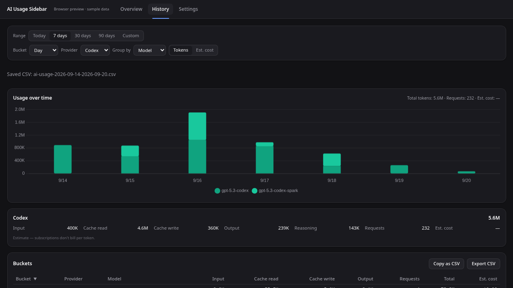
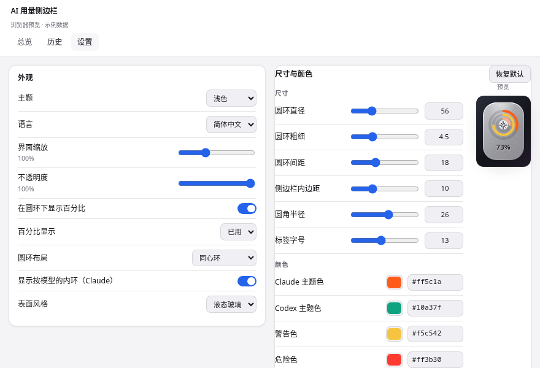

# Validation and remaining platform limits

The September 2026 stability pass covers the existing Claude/Codex sidebar,
popover and dashboard, with native CSV export. All automated data fixtures are
synthetic; tests do not require or print personal credentials or session logs.

## Repeatable checks

```sh
pnpm install --frozen-lockfile
pnpm check
pnpm test
pnpm exec playwright install chromium
pnpm test:e2e
pnpm build
cd src-tauri
cargo fmt --all -- --check
cargo clippy --locked --all-targets -- -D warnings
cargo test --locked
```

To use an already installed Chromium for browser tests, set
`PLAYWRIGHT_CHROMIUM_EXECUTABLE_PATH` to its executable path. Unit tests do not
launch a server or browser. E2E uses an isolated localhost Vite server; on Linux
CI, `playwright install --with-deps chromium` supplies browser dependencies.
Failures retain screenshots and traces in `test-results/`.

Browser captures below use sample data, not real accounts:




| Area | Evidence |
|---|---|
| UI and accessibility | Svelte/TypeScript checks; rendered dark English history and light Chinese settings reviewed at 1280×720 and 880×600 |
| History interactions | Browser tests filter by provider/model, validate dates, download and inspect CSV, exercise failed clipboard copy and missing-price feedback |
| Request ordering | Browser tests hold earlier successful/failed history requests until a newer request completes; final rows retain the newest filter |
| Settings | Unit tests cover rapid edits, failed writes, external window events, nested partial updates, persistence and notification order |
| Log ingestion | Rust fixtures cover append/rewrite/truncation, submillisecond timestamps, partial JSON/UTF-8, streaming duplicates and cumulative counters |
| Cost and quota integrity | Rust tests cover unknown-model aggregates, exact built-in prices, custom prefixes, editable table deletion, and excluding stale quota samples |
| Native geometry | Rust tests cover negative monitor origins, fractional/mixed DPI, work areas, clamping and hover timer cancellation |
| CSV file writing | Rust tests cover portable suggestions, Unicode/BOM, replacing an existing report, and preserving it when a write fails |
| Packaged apps | GitHub CI runs checks and builds installer artifacts on Ubuntu, macOS and Windows using locked dependencies; both workflows set `AWS_LC_SYS_PREBUILT_NASM=1` because rustls' `aws-lc-sys` aborts the Windows x86_64 build when NASM is absent |

## Linux native smoke check

The application was launched on the local XWayland desktop at 2× scale with
temporary XDG data/config directories and empty CLI credential directories.
The smoke check verified actual rendering, screen-edge placement, keep-above
and skip-taskbar flags, automatic collapse, hover expansion and popover,
second-instance dashboard activation, and close-to-hide behavior.

This caught GTK's 200 CSS-pixel natural minimum for non-resizable webviews.
The Linux implementation now uses equal minimum/maximum physical size hints:
the six CSS-pixel handle occupies twelve physical pixels at 2× scale, rather
than an invisible 400-pixel-wide window. Expanded dimensions are retained
when the frontend reports the collapsed handle's layout.

## Windows / macOS audit (desk check, no native hardware)

Neither OS can be exercised from the Linux development machine, so the
following was established by reading the code and the exact dependency
versions in `src-tauri/Cargo.lock`, not by running the app.

Verified as correct for all three desktop targets:

- Every `#[cfg(target_os = …)]` block in `src-tauri/src` leaves exactly one
  arm per platform, and each arm that ends a function body is still that
  body's tail expression after `cfg` stripping (checked against `rustc`).
  `window-vibrancy` 0.8 signatures match both the macOS (`apply_vibrancy`,
  `clear_vibrancy -> Result<bool, _>`) and Windows (`apply_acrylic`,
  `clear_acrylic`) call sites.
- Credential discovery: `CLAUDE_CONFIG_DIR` / `~/.claude` and `CODEX_HOME` /
  `~/.codex` resolve through `dirs::home_dir()`, which is `%USERPROFILE%` on
  Windows. On macOS Claude Code keeps its OAuth token in the login Keychain
  item `Claude Code-credentials` rather than in `.credentials.json`; the
  provider reads it through `security find-generic-password` and now caches
  the answer for two minutes so the refresh tick cannot raise a Keychain
  prompt every round, invalidating the cache on expiry and on HTTP 401/403.
- Log parsing is CRLF-safe: the Claude parser splits with `str::lines` and the
  Codex parser trims `\r` while counting byte offsets over the raw
  `split_inclusive('\n')` slices, so resume offsets stay right on Windows.
  Rust opens log files with full share access, so an appending
  `claude`/`codex` process does not block ingestion.
- CSV export writes CRLF rows with a UTF-8 BOM (Excel on Windows) through the
  native save dialog, which `tauri-plugin-dialog` marshals to the main thread,
  and `blocking_save_file` is called from `spawn_blocking`, never the main
  thread. Project names split on both `/` and `\`.
- `tauri.conf.json`: `macOSPrivateApi` is on for the transparent overlays,
  `icon.icns` (ic07–ic14) and `icon.ico` are present, and the bundler filters
  the full `targets` list down to the ones each platform supports. The
  capability's window labels match the three configured windows and cover
  everything the frontend calls directly (`opener:allow-open-url`; the dialog
  is invoked from Rust and needs no permission).
- Autostart resolves the right launcher on each OS (registry Run key, macOS
  LaunchAgent, AppImage path on Linux).

## What these checks do not establish

- Browser tests use mocks and do not validate live provider credentials or
  undocumented quota endpoints. Parser fixtures prove supported payload
  handling; providers can change those endpoints independently.
- macOS/Windows CI establishes native compilation, tests and installer
  generation, not hands-on behavior with every window manager, DPI setup,
  accessibility tool, permission prompt or graphics driver. Native save-dialog
  interaction still needs manual confirmation on each OS.
- Native Wayland positioning still requires the planned layer-shell work;
  XWayland is the supported docking path. Pure Wayland fallback opens the app
  but lets the compositor place its windows.
- macOS notarization and Windows signing require maintainer certificates and
  are not configured. CI artifacts are unsigned; no release is automatically
  published by a push to `main`.

Known cross-platform gaps found by the audit and **not** fixed yet:

- `icons/tray.png` is pure white plus alpha. That is exactly right for the
  macOS template icon, but Windows and Linux draw the file as-is, so the tray
  glyph disappears on a light Windows 11 taskbar. It needs a second,
  non-template asset selected at runtime in `window/tray.rs`.
- macOS keeps a Dock icon and an app menu: nothing sets
  `ActivationPolicy::Accessory`, so autostart shows a Dock entry whose only
  window is hidden.
- `tao`'s `set_visible_on_all_workspaces` only adds `CanJoinAllSpaces`, and
  `set_always_on_top` only raises the window to the floating level, so on
  macOS the overlays still disappear while another app is full-screen;
  `NSWindowCollectionBehaviorFullScreenAuxiliary` would be required.
- The `--hidden` argument handed to the autostart entry is never read.
- The usage database lives in `app_data_dir()`, i.e. the roaming profile on
  Windows; `app_local_data_dir()` would keep SQLite off a redirected share.
- `profile.release` sets `panic = "abort"`, so a panic in a blocking task
  kills the app instead of taking the error paths that handle `JoinError`,
  and with `windows_subsystem = "windows"` it does so without any message.

The roadmap in the README tracks future additions separately from the current
Claude/Codex feature set.
