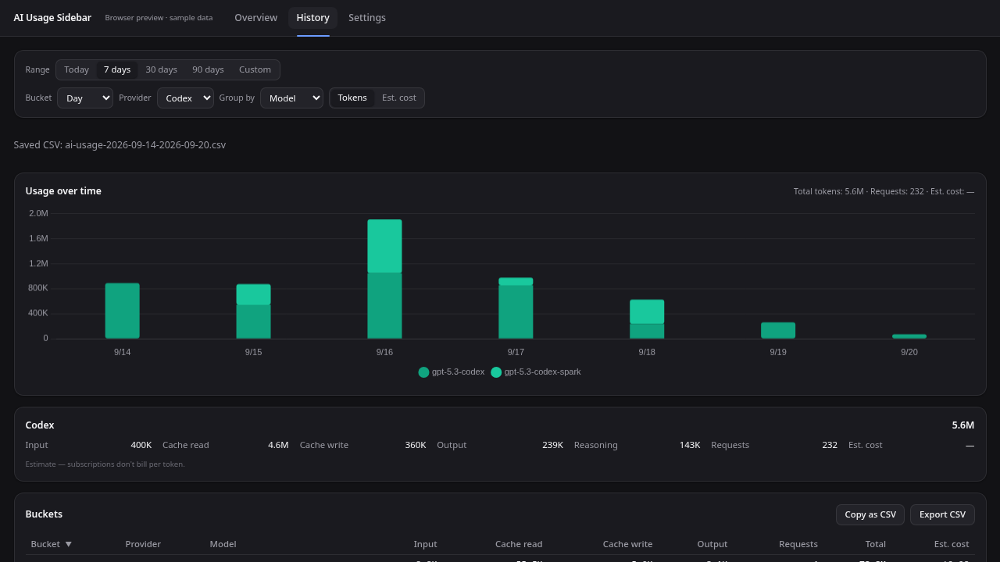
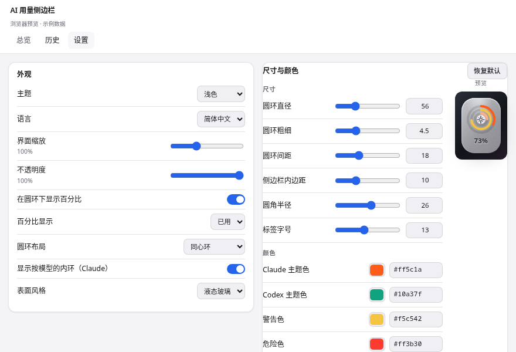

# Validation and remaining platform limits

The September 2026 stability pass covers the existing Claude/Codex sidebar,
popover and dashboard, with native CSV export. All automated data fixtures are
synthetic; tests do not require or print personal credentials or session logs.

## Upgrade and settings-robustness harness (v0.7)

Two release-day bugs in v0.6.0 (an external edit of `settings.json` brought
back the first-run wizard; a UTF-8 BOM made the whole file invalid and the next
start reset every setting) were not caught by CI because no test opened a file
or database written by an *older* version. The harness in
`src-tauri/src/upgrade_tests/` does, with fixtures in `src-tauri/tests/fixtures/`
(provenance in its `README.md`):

- `db.rs`: for each schema ever released (v0.2.2, v0.3.0, v0.5.0, v0.6.0) the
  fixture SQL rebuilds that version's `usage.db`; `Db::open` must migrate it to
  `SCHEMA_VERSION` keeping every row, give new columns their documented defaults
  (`quota_samples.account = ''`), end with exactly the schema of a fresh
  database, be idempotent when reopened, answer the current queries, and roll
  back completely when a step fails.
- `settings_files.rs`: for each released default file (and a fully customised
  one) `settings::load` and `settings::reload_action` must keep every field the
  file specifies; a table of hostile files (BOM, UTF-16, CRLF, half-written,
  trailing garbage, empty, `null`/array root, wrong types, out-of-range numbers,
  unknown keys, deep nesting, 2 MB, duplicate keys, missing app-owned keys)
  checks the invariants: a bad file never replaces live settings on hot reload;
  at start-up it falls back to defaults, is left untouched, and the next save
  keeps a copy as `settings.json.bad-<ms>` (three newest are kept).
  UTF-16 (what a PowerShell 5 `>` redirect writes) is decoded, not rejected.
  `{}` is a valid file and resets preferences by design; the app-owned records
  (`onboarded`, `lastSeenVersion`, `skippedVersion`) are kept regardless.

Run just these with `cargo test --locked upgrade_tests` in `src-tauri`.

### When the schema or the settings change

1. **Database:** if you bump `SCHEMA_VERSION` or add a table/column/index,
   add `src-tauri/tests/fixtures/db/v<last released tag>.sql` for the version
   *being replaced* (DDL from `git show <tag>:src-tauri/src/store/mod.rs`,
   `sessions/store.rs`, `evaluation.rs`; a small synthetic dataset), register
   it in `FIXTURES` in `upgrade_tests/db.rs`, and list it in the fixtures
   README. Existing fixtures are never edited.
2. **Settings:** if a field is added, renamed, removed or its default changes,
   add `v<tag>-default.json` / `-customised.json` for the last released
   version in `fixtures/settings/`, register them in `FILES`, and update the
   expectations in `keys_added_after_a_version_load_with_their_defaults`.
   `the_default_fixtures_still_match_todays_defaults` fails on a changed
   default: decide whether that behaviour change is intended.
3. Run the harness before the release PR (it is part of `cargo test`).

## v0.5.0 session analysis validation

The session-analysis implementation was developed and checked on Windows x64.
Final local results: 266 Rust tests passed (the 2 ignored benchmarks passed in a
separate run), 86 frontend unit tests and 6 no-input render tests passed. Cargo
fmt and strict Clippy passed; frontend typecheck reported no errors or warnings,
and the static production build completed.
Synthetic Rust fixtures cover title precedence, more than 200 sessions with
server pagination, source replacement/expiry, partial lines, parent/child
attribution, delayed streaming replies, unknown turn usage and opt-in preparation.
Evaluation tests use a loopback HTTP server: exact reviewed payload, missing keys,
timeouts, disabled redirects/retries, bounded responses, evidence validation,
report reuse and preserving human revisions. No paid service or private session
was used for these checks.

Frontend unit checks cover filters, pagination, stable identity, message merging,
input budgets, mock data and opt-in behavior. The additional render suite observes
synthetic pages and events without simulated mouse or keyboard input:

```sh
pnpm exec playwright test --config=tests/render.config.ts
```

Its fixtures cover English dark/light layouts, a narrow Chinese layout, long
history tables and Chart.js instance reuse. Default CI runs this no-input suite;
the older interactive browser scenarios require the explicit
`interactive_browser_tests` manual workflow option. This follows AGENTS.md's
restriction on simulated input during agent validation. See [PERFORMANCE.md](PERFORMANCE.md) for repeatable
benchmarks and measurement limits, and [SESSIONS.md](SESSIONS.md) for content
retention, endpoint setup and the interpretation of assessments.

The Windows development filesystem required a temporary hoisted pnpm install
and a Cargo build/cache directory on NTFS. The nested worktree's local Vite
build used an explicit tsconfig path. These environment-specific workarounds
are not application configuration or release dependencies. GitHub CI builds
from a normal checkout with the checked-in lockfiles.

### v0.5.0 release evidence

The release source is `f5f736fd48860b590fc4337d69262055808cf443`, pushed to
`main` and referenced by the annotated `v0.5.0` tag. [CI run 36440309118](https://github.com/harveyxiacn/AI-usage-monitor-sidebar/actions/runs/36440309118)
passed on Windows, macOS and Ubuntu, including the separate native Linux startup
smoke test. [Release run 36441985420](https://github.com/harveyxiacn/AI-usage-monitor-sidebar/actions/runs/36441985420)
passed for Windows x64, Linux x64 and both macOS architectures.

[v0.5.0](https://github.com/harveyxiacn/AI-usage-monitor-sidebar/releases/tag/v0.5.0)
was published as the latest stable release on 2026-09-29 UTC. Verification
downloaded all 17 assets (147,215,566 bytes) and matched their sizes and SHA-256
digests against GitHub's metadata. The seven installer variants are Windows
EXE/MSI, Linux AppImage/DEB/RPM, and macOS Apple Silicon/Intel DMG.

The updater manifest contains 11 platform entries covering four architecture
families and seven distinct update payloads. Every payload's bytes and trusted
comment passed Minisign/Ed25519 verification using the unchanged public key in
`tauri.conf.json`; detached `.sig` assets matched the manifest signatures.
After publication, anonymous requests confirmed that all 17 asset URLs returned
HTTP 200 with the expected sizes, the public latest-release endpoint returned
`v0.5.0`, and `releases/latest/download/latest.json` exactly matched the verified
manifest. These checks establish artifact integrity and availability; they do
not claim hands-on installation on every platform or a live paid AI evaluation.

## Repeatable checks

```sh
pnpm install --frozen-lockfile
pnpm check
pnpm test
pnpm exec playwright install chromium
pnpm exec playwright test --config=tests/render.config.ts
pnpm build
cd src-tauri
cargo fmt --all -- --check
cargo clippy --locked --all-targets -- -D warnings
cargo test --locked
```

To use an already installed Chromium for browser tests, set
`PLAYWRIGHT_CHROMIUM_EXECUTABLE_PATH` to its executable path. Unit tests do not
launch a server or browser. E2E uses an isolated localhost Vite server; on Linux
CI, `playwright install --with-deps chromium` supplies browser dependencies.
Failures retain screenshots and traces in `test-results/`.

Browser captures below use sample data, not real accounts:




| Area | Evidence |
|---|---|
| UI and accessibility | Svelte/TypeScript checks; rendered dark English history and light Chinese settings reviewed at 1280×720 and 880×600 |
| History interactions | Browser tests filter by provider/model, validate dates, download and inspect CSV, exercise failed clipboard copy and missing-price feedback |
| Request ordering | Browser tests hold earlier successful/failed history requests until a newer request completes; final rows retain the newest filter |
| Settings | Unit tests cover rapid edits, failed writes, external window events, nested partial updates, persistence and notification order |
| Log ingestion | Rust fixtures cover append/rewrite/truncation, submillisecond timestamps, partial JSON/UTF-8, streaming duplicates and cumulative counters |
| Cost and quota integrity | Rust tests cover unknown-model aggregates, exact built-in prices, custom prefixes, editable table deletion, and excluding stale quota samples |
| Native geometry | Rust tests cover negative monitor origins, fractional/mixed DPI, work areas, clamping and hover timer cancellation |
| CSV file writing | Rust tests cover portable suggestions, Unicode/BOM, replacing an existing report, and preserving it when a write fails |
| Packaged apps | GitHub CI runs checks and builds installer artifacts on Ubuntu, macOS and Windows using locked dependencies; both workflows set `AWS_LC_SYS_PREBUILT_NASM=1` because rustls' `aws-lc-sys` aborts the Windows x86_64 build when NASM is absent |

## Automated start-up and upgrade smoke tests (CI)

The jobs below launch the real, freshly built application. None of them
simulates mouse or keyboard input; they read the app's own log.

| Job | Runs on | What it asserts |
|---|---|---|
| `Linux start-up smoke test` (`scripts/smoke-linux.sh`) | every CI run | Xvfb + private XDG home; `sidebar revealed` and `platform setup:` in the log; no `panicked` / `[ERROR]` line |
| `Windows start-up smoke test` (`scripts/smoke-windows.ps1`) | every CI run | release exe on `windows-latest`; the same lines plus `tray menu ready` within 90 s |
| `macOS start-up smoke test` (`scripts/smoke-macos.sh`) | every CI run | the built `.app` (shipped from the build job as a tar to keep the executable bit) on `macos-latest`; same assertions. CI has no `Claude Code-credentials` Keychain item, so no prompt can block start-up |
| `Upgrade from <tag> (<os>)` | pull requests and manual runs only | 3 OS x {`v0.5.0`, latest release}. Installs the previous published release (Windows `*_x64-setup.exe` with `/S`, macOS `*.dmg` for the runner architecture, Linux AppImage with extract-and-run), starts it, stops it, seeds a hand-written `settings.json` (UTF-8 BOM, partial keys: `edge: left`, `autoHide: true`, `language: zh-CN`), then starts the new build on the same profile |

The upgrade jobs assert, from the new build's own log only (the previous run's
log is moved away first): the new build reveals the sidebar; the
`platform setup:` line reports `edge=Left` and `autoHide=true` (so the BOM file
was parsed and applied at start-up); and, for `v0.5.0`, the line
`usage.db schema 2 -> N` (the real migration). The `latest` leg does not require
a migration line, because it is legitimately absent when the schema did not
change. These checks would have caught both v0.6 release bugs.

First all-green run of the full set (12 jobs, including all six upgrade legs):
[CI run 37016050751](https://github.com/harveyxiacn/AI-usage-monitor-sidebar/actions/runs/37016050751).

On failure each job uploads its logs as an artifact (`smoke-logs-*`,
`upgrade-logs-*`, 7 days). The Windows and macOS scripts refuse to run outside
CI unless `SMOKE_ALLOW_REAL_PROFILE=1` is set, because they use the real
profile; `scripts/smoke-linux.sh` always uses a private one.

## Linux native smoke check

The application was launched on the local XWayland desktop at 2× scale with
temporary XDG data/config directories and empty CLI credential directories.
The smoke check verified actual rendering, screen-edge placement, keep-above
and skip-taskbar flags, automatic collapse, hover expansion and popover,
second-instance dashboard activation, and close-to-hide behavior.

This caught GTK's 200 CSS-pixel natural minimum for non-resizable webviews.
The Linux implementation now uses equal minimum/maximum physical size hints:
the six CSS-pixel handle occupies twelve physical pixels at 2× scale, rather
than an invisible 400-pixel-wide window. Expanded dimensions are retained
when the frontend reports the collapsed handle's layout.

## Earlier Windows / macOS audit (desk check from Linux)

Neither OS can be exercised from the Linux development machine, so the
following was established by reading the code and the exact dependency
versions in `src-tauri/Cargo.lock`, not by running the app.

Verified as correct for all three desktop targets:

- Every `#[cfg(target_os = …)]` block in `src-tauri/src` leaves exactly one
  arm per platform, and each arm that ends a function body is still that
  body's tail expression after `cfg` stripping (checked against `rustc`).
  `window-vibrancy` 0.8 signatures match both the macOS (`apply_vibrancy`,
  `clear_vibrancy -> Result<bool, _>`) and Windows (`apply_acrylic`,
  `clear_acrylic`) call sites.
- Credential discovery: `CLAUDE_CONFIG_DIR` / `~/.claude` and `CODEX_HOME` /
  `~/.codex` resolve through `dirs::home_dir()`, which is `%USERPROFILE%` on
  Windows. On macOS Claude Code keeps its OAuth token in the login Keychain
  item `Claude Code-credentials` rather than in `.credentials.json`; the
  provider reads it through `security find-generic-password` and now caches
  the answer for two minutes so the refresh tick cannot raise a Keychain
  prompt every round, invalidating the cache on expiry and on HTTP 401/403.
- Log parsing is CRLF-safe: the Claude parser splits with `str::lines` and the
  Codex parser trims `\r` while counting byte offsets over the raw
  `split_inclusive('\n')` slices, so resume offsets stay right on Windows.
  Rust opens log files with full share access, so an appending
  `claude`/`codex` process does not block ingestion.
- CSV export writes CRLF rows with a UTF-8 BOM (Excel on Windows) through the
  native save dialog, which `tauri-plugin-dialog` marshals to the main thread,
  and `blocking_save_file` is called from `spawn_blocking`, never the main
  thread. Project names split on both `/` and `\`.
- `tauri.conf.json`: `macOSPrivateApi` is on for the transparent overlays,
  `icon.icns` (ic07–ic14) and `icon.ico` are present, and the bundler filters
  the full `targets` list down to the ones each platform supports. The
  capability's window labels match the three configured windows and cover
  everything the frontend calls directly (`opener:allow-open-url`; the dialog
  is invoked from Rust and needs no permission).
- Autostart resolves the right launcher on each OS (registry Run key, macOS
  LaunchAgent, AppImage path on Linux).

## What these checks do not establish

- Browser tests use mocks and do not validate live provider credentials or
  undocumented quota endpoints. Parser fixtures prove supported payload
  handling; providers can change those endpoints independently.
- macOS/Windows CI establishes native compilation, tests and installer
  generation, not hands-on behavior with every window manager, DPI setup,
  accessibility tool, permission prompt or graphics driver. Native save-dialog
  interaction still needs manual confirmation on each OS.
- Native Wayland positioning still requires the planned layer-shell work;
  XWayland is the supported docking path. Pure Wayland fallback opens the app
  but lets the compositor place its windows.
- macOS notarization and Windows signing require maintainer certificates and
  are not configured. CI artifacts are unsigned; no release is automatically
  published by a push to `main`.

Known cross-platform gaps found by the audit and **not** fixed yet:

- `icons/tray.png` is pure white plus alpha. That is exactly right for the
  macOS template icon, but Windows and Linux draw the file as-is, so the tray
  glyph disappears on a light Windows 11 taskbar. It needs a second,
  non-template asset selected at runtime in `window/tray.rs`.
- macOS keeps a Dock icon and an app menu: nothing sets
  `ActivationPolicy::Accessory`, so autostart shows a Dock entry whose only
  window is hidden.
- `tao`'s `set_visible_on_all_workspaces` only adds `CanJoinAllSpaces`, and
  `set_always_on_top` only raises the window to the floating level, so on
  macOS the overlays still disappear while another app is full-screen;
  `NSWindowCollectionBehaviorFullScreenAuxiliary` would be required.
- The `--hidden` argument handed to the autostart entry is never read.
- The usage database lives in `app_data_dir()`, i.e. the roaming profile on
  Windows; `app_local_data_dir()` would keep SQLite off a redirected share.
- `profile.release` sets `panic = "abort"`, so a panic in a blocking task
  kills the app instead of taking the error paths that handle `JoinError`,
  and with `windows_subsystem = "windows"` it does so without any message.

The roadmap in the README tracks future additions separately from the current
Claude/Codex feature set.
